# termui [](https://travis-ci.org/gizak/termui) [](https://godoc.org/github.com/gizak/termui)

## Update 23/06/2015
Pull requests and master branch are freezing, waiting for merging from `refactoring` branch.

## Notice
termui comes with ABSOLUTELY NO WARRANTY, and there is a breaking change coming up (see refactoring branch) which will change the `Bufferer` interface and many others. These changes reduce calculation overhead and introduce a new drawing buffer with better capacibilities. We will step into the next stage (call it beta) after merging these changes.

## Introduction
Go terminal dashboard. Inspired by [blessed-contrib](https://github.com/yaronn/blessed-contrib), but purely in Go.

Cross-platform, easy to compile, and fully-customizable.

__Demo:__ (cast under osx 10.10; Terminal.app; Menlo Regular 12pt.)

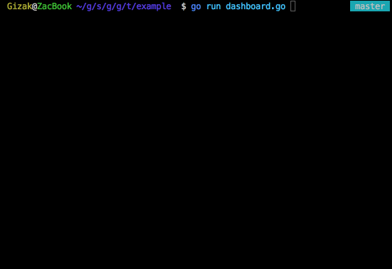

__Grid layout:__

Expressive syntax, using [12 columns grid system](http://www.w3schools.com/bootstrap/bootstrap_grid_system.asp)
```go
	import ui "github.com/gizak/termui"
	// init and create widgets...

	// build
	ui.Body.AddRows(
		ui.NewRow(
			ui.NewCol(6, 0, widget0),
			ui.NewCol(6, 0, widget1)),
		ui.NewRow(
			ui.NewCol(3, 0, widget2),
			ui.NewCol(3, 0, widget30, widget31, widget32),
			ui.NewCol(6, 0, widget4)))

	// calculate layout
	ui.Body.Align()

	ui.Render(ui.Body)
```
[demo code:](https://github.com/gizak/termui/blob/master/example/grid.go)

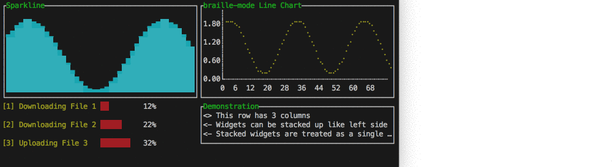

## Installation

	go get github.com/gizak/termui

## Usage

Each component's layout is a bit like HTML block (box model), which has border and padding.

The `Border` property can be chosen to hide or display (with its border label), when it comes to display, the label takes 1 padding space (i.e. in css: `padding: 1;`, innerHeight and innerWidth therefore shrunk by 1).

`````go
	import ui "github.com/gizak/termui" // <- ui shortcut, optional

	func main() {
		err := ui.Init()
		if err != nil {
			panic(err)
		}
		defer ui.Close()

		p := ui.NewPar(":PRESS q TO QUIT DEMO")
		p.Height = 3
		p.Width = 50
		p.TextFgColor = ui.ColorWhite
		p.Border.Label = "Text Box"
		p.Border.FgColor = ui.ColorCyan

		g := ui.NewGauge()
		g.Percent = 50
		g.Width = 50
		g.Height = 3
		g.Y = 11
		g.Border.Label = "Gauge"
		g.BarColor = ui.ColorRed
		g.Border.FgColor = ui.ColorWhite
		g.Border.LabelFgColor = ui.ColorCyan

		ui.Render(p, g)

		// event handler...
	}
`````

Note that components can be overlapped (I'd rather call this a feature...), `Render(rs ...Renderer)` renders its args from left to right (i.e. each component's weight is arising from left to right).

## Themes

_All_ colors in _all_ components can be changed at _any_ time, while there provides some predefined color schemes:

```go
// for now there are only two themes: default and helloworld
termui.UseTheme("helloworld")

// create components...
```
The `default ` theme's settings depend on the user's terminal color scheme, which is saying if your terminal default font color is white and background is white, it will be like:

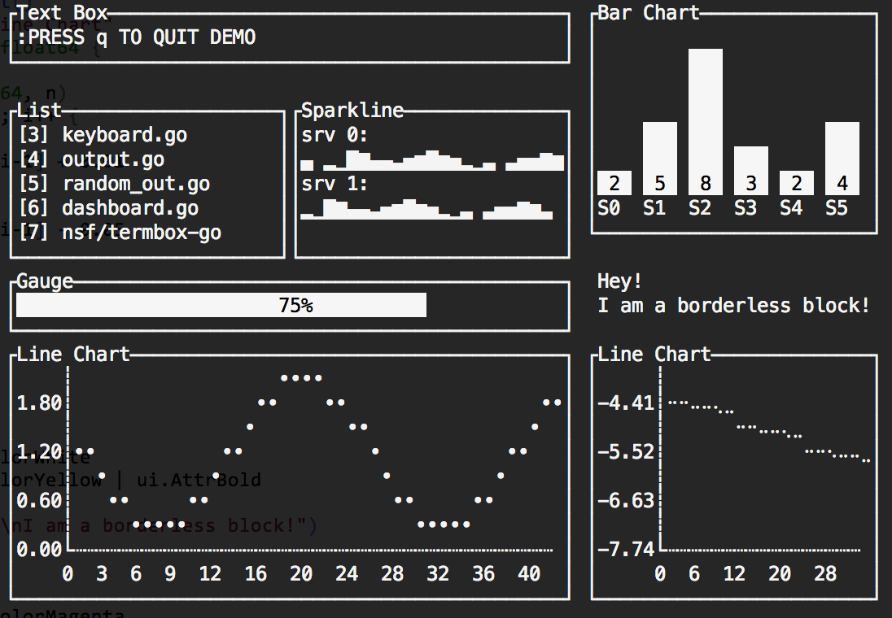

The `helloworld` color scheme drops in some colors!

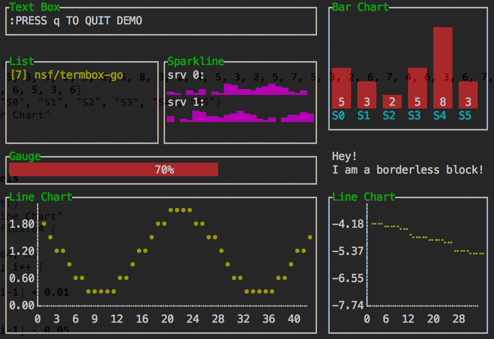

## Widgets

#### Par

[demo code](https://github.com/gizak/termui/blob/master/example/par.go)

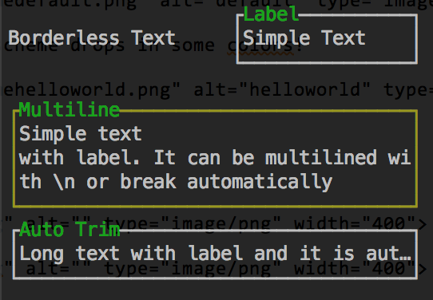

#### List
[demo code](https://github.com/gizak/termui/blob/master/example/list.go)

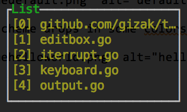

#### Gauge
[demo code](https://github.com/gizak/termui/blob/master/example/gauge.go)

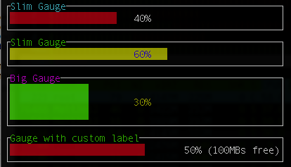

#### Line Chart
[demo code](https://github.com/gizak/termui/blob/master/example/linechart.go)

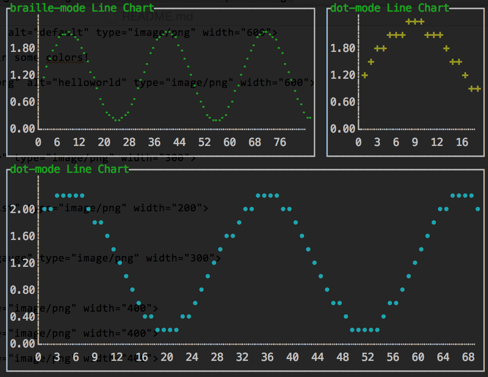

#### Bar Chart
[demo code](https://github.com/gizak/termui/blob/master/example/barchart.go)

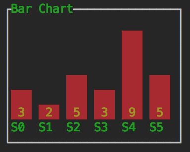

#### Mult-Bar / Stacked-Bar Chart
[demo code](https://github.com/gizak/termui/blob/master/example/mbarchart.go)

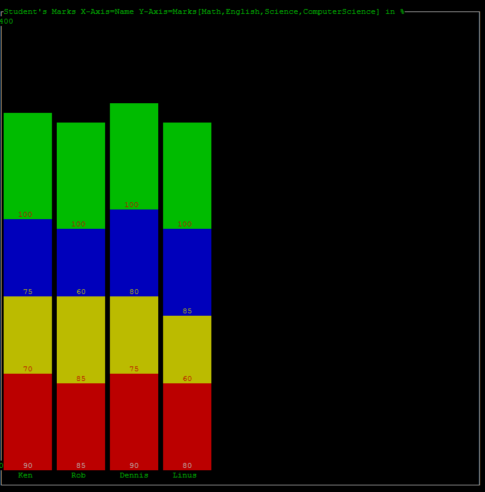

#### Sparklines
[demo code](https://github.com/gizak/termui/blob/master/example/sparklines.go)

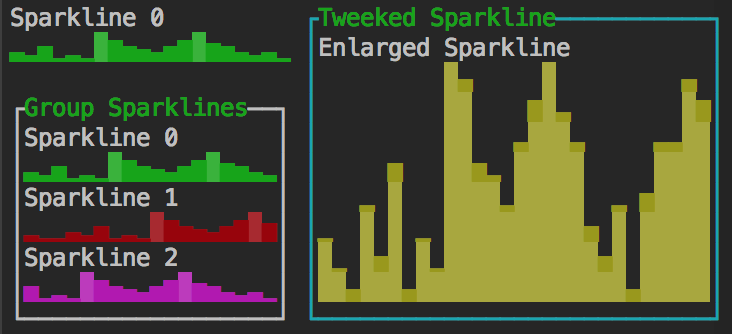


## GoDoc

[godoc](https://godoc.org/github.com/gizak/termui)

## TODO

- [x] Grid layout
- [ ] Event system
- [ ] Canvas widget
- [ ] Refine APIs
- [ ] Focusable widgets

## License
This library is under the [MIT License](http://opensource.org/licenses/MIT)
