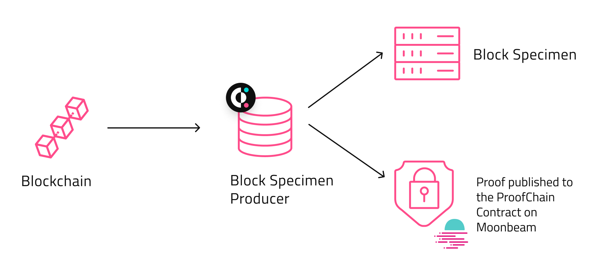
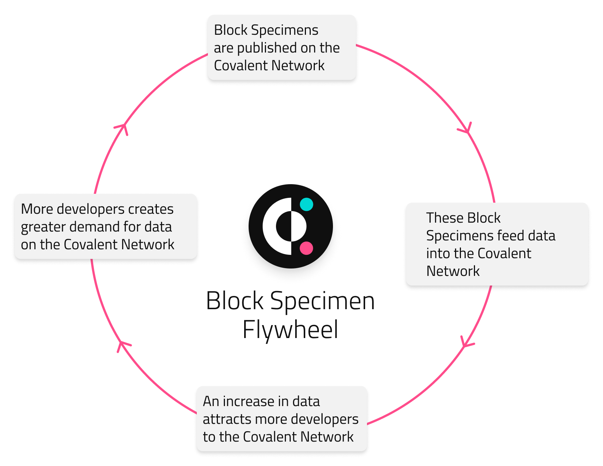
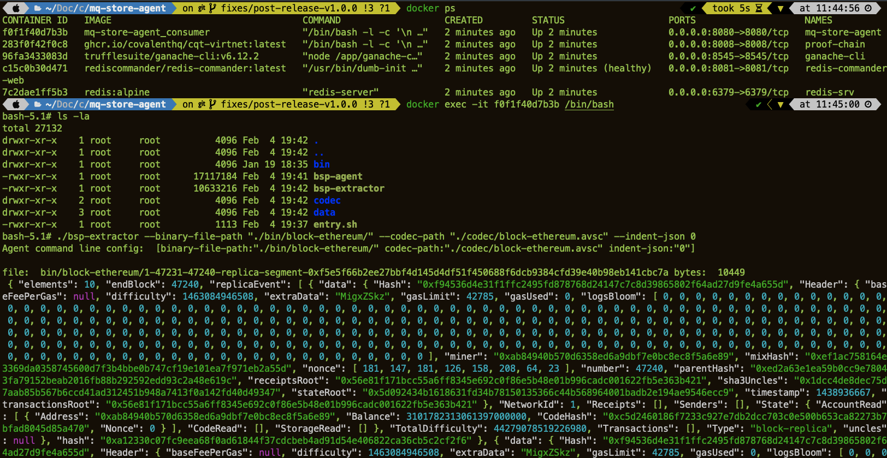

<div align="center">
  <a href="https://github.com/covalenthq/bsp-geth/releases/latest">
    
  </a>
  <a href="https://github.com/covalenthq/bsp-geth/blob/main/LICENSE">
    
  </a>
  <a href="https://goreportcard.com/report/github.com/covalenthq/bsp-geth">
    
  </a>
  <a href="http://covalenthq.com/discord">
    
  </a>
  <a href="https://bestpractices.coreinfrastructure.org/projects/0000">
    
  </a>
   <a href="https://bestpractices.coreinfrastructure.org/projects/5644">
     
  </a>
</div>
<div align="center">
  <a href="http://covalenthq.com/discord">
    
  </a>
  <a href="https://github.com/covalenthq/bsp-geth/actions/workflows/golangci-lint.yml?query=branch%3Acovalent+workflow%3Agolangci-lint">
    
  </a>
  <a href="https://github.com/covalenthq/bsp-geth/actions/workflows/docker-image.yml?query=branch%3Acovalent+workflow%3Adocker-image-ci">
    
  </a>
  <a href="https://github.com/covalenthq/bsp-geth/actions/workflows/build-test.yml?query=branch%3Acovalent+workflow%3Abuild-test">
    
  </a>
  <a href="https://codecov.io/gh/covalenthq/bsp-geth">
    
  </a>
  <a href="https://twitter.com/@Covalent_HQ">
    
  </a>
</div>

# Block Specimen Producer (BSP Geth)

* [Introduction](#bsp_intro)
  * [Resources](#bsp_resources)
* [Raison d'être](#bsp_why)
* [Architecture](#bsp_arch)
* [Docker Run](#docker)
* [Build & Run](#build_run)
  * [Flag Definitions](#flag_definitions)
* [Contributing](./docs/CONTRIBUTING.md)
* [Go Ethereum](#geth)

## <span id="bsp_intro">Introduction</span>

Essential to the Covalent Network is the Block Specimen and the Block Specimen Producer (BSP), a bulk export method that ultimately leads to the generation of a canonical representation of a blockchains historical state. Currently implemented on existing blockchain clients running Geth. It functions currently as an -

1. Blockchain data extractor
1. Blockchain data normalizer

What is ultimately created is a ‘Block Specimen’, a universal canonical representation of a blockchains historical state.

There are two further considerations regarding the Block Specimen.

1. The BSP is completely standalone on forks of Geth.
1. The separation of data storage layer from the block execution and distributed consensus functionality leads to better segregation and upgrades of functionality in the blockhain data processing pipeline.

As a result, anyone can run full tracing on the block specimen and accurately recreate the blockchain without access to a blockchain client software.

## <span id="bsp_resources">Resources</span>

Production of Block Specimens forms the core of the network’s data objects specification. These objects are created with the aid of three main pieces of open-source software provided by Covalent for the network’s decentralized stack.

1. [Block Specimen Producer (BSP Geth)](https://github.com/covalenthq/bsp-geth) - Operator run & deployed

1. [BSP Agent](https://github.com/covalenthq/bsp-agent) - Operator run & deployed

1. [BSP Proof-chain](https://github.com/covalenthq/cqt-virtnet) - Covalent operated & pre-deployed

Please refer to these [instructions](https://docs.google.com/document/d/1N_HxUi6ZEkub9EHANe49vkL9iQztVA_ACyfHcOZV5y0/edit?usp=sharing) for running the BSP with the bsp-agent (BSP Agent).

Please refer to this [whitepaper](https://www.covalenthq.com/static/documents/Block%20Specimen%20Whitepaper%20V1.1.pdf) to understand more about its function.


## <span id="bsp_why">Raison d'être</span>


The blockchain space has been and will continue to be laser-focused on *write* scalability. That is, actually writing on the blockchain (confirming a transaction) and doing so efficiently. And the projects tackling this issue, be it Layer 1s or Layer 2s, have certainly made operating in this space more accommodating, leading to increased adoption as powerful and scalable applications are being developed.

However, this is only one side of the scalability issue that troubles the space. On the flip side you have the issue of *read scalability*. This is different to *write* as the focus with *read* is on extracting and reading the data on the blockchain, whether that be Ethereum, Avalanche or Solana.

One common method of reading data from Ethereum for example is the JSON RPC Layer. A number of issues present themselves however when doing so.

- **Slow**: One needs to make a series of individual data queries to extract the block and its constituent elements like transactions and receipts.

- **Not Multiversion**: Multiversion concurrency control methods are traditionally employed in databases to ensure point-in-time consistent views if multiple parties are viewing or querying the database. Such methods do not exist in web3.

- **Expensive**: To access historical data at any point in time, you need to run your blockchain clients in a mode known as “full archive nodes” - which requires specialized and expensive hardware to scale.

- **The Purge:** For Ethereum specifically, Vitalik recently outlined an updated roadmap for its development which included a phase titled ‘The Purge’. Once this phase is implemented, clients will no longer store historical data older than a year. Hence, alternatives will be needed to access Ethereums full historical state.

Meanwhile, data mappers and static dashboards are great for examining specific metrics and small tables (so long as the smart contract is decoded) but lack flexibility and scalability. Our belief is that -

1. fast, cheap and accessible read capabilities will lead to more diverse and better-adapted blockchain technologies.

1. should be accessible to all, no matter the skill level.

The Block Specimen is **the solution** to tackle the read scalability issues that currently plague blockchains.

## <span id="bsp_arch">Architecture</span>



While Block Specimens are currently being created internally at Covalent for each respective blockchain indexed, the Covalent Network shifts this responsibility to operators (anyone performing a role on the Covalent Network). Any operator on the network will be able to opt in to act as a Block Specimen Producer (BSP).

To ensure that the data within the block-specimens that operators create is reliable and honest, a production proof is created for every Block Specimen produced. These will be published to proofing contract deployed by Covalent. Therefore, Block Specimen proofs can be compared and any deviations in the data either accidentally or malicious will have mismatching proofs.




In sum, it is the responsibility of the BSPs to consume blocks from external blockchains and publish both the BSP along with a production proof to the Covalent virtual chain. As the network is developed, Covalent will be shifting the responsibility of running the Block Specimen software to operators (anyone performing a role on the Covalent Network). These Block Specimens will consume blocks from external blockchains and feed the entire network with the data needed to answer user queries.

How does this create and accrue value for the Covalent Network? As Block Specimen Producers publish more data to Covalent Network, developers will be attracted. With a growing developer base on the Covalent Network, there will be a greater appetite for blockchain data. And hence, the cycle begins again, with Block Specimens expected to meet this demand for data.
Of course, operators who successfully perform this role will be compensated in CQT.

## <span id="docker">Docker Run</span>

Please install [docker and docker-compose](https://docs.docker.com/compose/install/).

Employ `docker-compose` to get all the necessary services along with BSP Geth to also get running along side it. With `docker-compose` BSP Geth creates block-specimens that are extracted Live for Ethereum Mainnet, pushes them to the Redis stream queue, the BSP Agent service then reads the RLP block-specimens and processes the messages from the redis stream and stores/uploads them according to the configuration given to it. The BSP Agent makes statements about the block-specimens by writing to a proxy proof-chain smart contract that is deployed on a test ganache blockchain i.e the proving aspects happen locally and not on a public blockchain. The Specimens stored locally or uploaded to google cloud storage however retain full validity (if the BSP Geth / Agent source code is not altered.) Add an .env file (if needed) to accomodate the env vars.

In the future, for the BSP Agent the flags `--eth-client` pointing to a Mainnet ethereum client & `--proof-chain-address` pointing to the correct version of the deployed proofing contract along with the an `.env` file with `ETH_PRIVATE_KEY` var will have to be updated to run entirely for CQT Mainnet.
These changes can also be directly adapted into the docker-compose.yml file in this directory.

The list of all services are -

1. redis-srv (Open source (BSD licensed), in-memory data structure store)
1. redis-commander-web (Redis web management tool written in node.js)
1. ganache-cli (Ethereum blockchain & client)
1. proof-chain (Validation (proofing) smart-contracts)
1. bsp-agent (Block specimen decoder, packer, prover and storer)

```bash
git clone git@github.com:covalenthq/bsp-geth.git
cd bsp-geth
docker-compose -f "docker-compose-testnet.yml" up
```

If all the services are up and running well, expect to see the logs similar to the following, in approx ~ 10 mins, as the node begins to sync and export Block Specimens. Please note we don't advice running bsp-geth and bsp-agent in production with docker (this is only for demo purposes).

```bash
bsp-geth           | INFO [02-04|18:59:33.731|core/block_replica.go:36]             Creating block replication event         block number=139 hash=0x41d2931a4495deabbf9f58181a48d29c89036c8fb8b9ecedb5f23805cc6f5e34
bsp-geth           | INFO [02-04|18:59:33.745|core/block_replica.go:36]             Creating block replication event         block number=140 hash=0xe2c1e8200ef2e9fba09979f0b504dc52c068719623c7064904c7bd3e9365acc1
ganache-cli        |
ganache-cli        |   Transaction: 0x398c2d9c820a6bbdfd7de696b7e049b25114285f00a4c12f49ef492bf2522858
ganache-cli        |   Gas usage: 48457
ganache-cli        |   Block Number: 9
ganache-cli        |   Block Time: Fri Feb 04 2022 18:59:33 GMT+0000 (Coordinated Universal Time)
ganache-cli        |
ganache-cli        | eth_getTransactionReceipt
bsp-geth           | INFO [02-04|18:59:33.819|core/block_replica.go:36]             Creating block replication event         block number=141 hash=0xeafbe76fdcadc1b69ba248589eb2a674b60b00c84374c149c9deaf5596183932
bsp-agent          | time="2022-02-04T18:59:33Z" level=info msg="Proof-chain tx hash: 0x398c2d9c820a6bbdfd7de696b7e049b25114285f00a4c12f49ef492bf2522858 for block-replica segment: 1-1-10-replica-segment" function=EncodeProveAndUploadReplicaSegment line=63
bsp-agent          | time="2022-02-04T18:59:33Z" level=info msg="File written successfully to: ./bin/block-ethereum/1-1-10-replica-segment-0x398c2d9c820a6bbdfd7de696b7e049b25114285f00a4c12f49ef492bf2522858" function=writeToBinFile line=88
bsp-geth           | INFO [02-04|18:59:33.855|core/block_replica.go:36]             Creating block replication event         block number=142 hash=0x8ff76dc49f9a1492813a281a474f102890cdd5a42399241d5fa403f201a4d7cf
bsp-agent          |
bsp-agent          | ---> Processing 1-11-20-replica-segment <---
bsp-agent          | time="2022-02-04T18:59:33Z" level=info msg="Submitting block-replica segment proof for: 1-11-20-replica-seg
```

with occasional responses from `bsp-agent` service such as -

```bash
bsp-agent          | ---> Processing 1-61-70-replica-segment <---
bsp-agent          | time="2022-02-04T19:00:04Z" level=info msg="Submitting block-replica segment proof for: 1-61-70-replica-segment" function=EncodeProveAndUploadReplicaSegment line=57
bsp-agent          | time="2022-02-04T19:00:04Z" level=info msg="Proof-chain tx hash: 0x85b5e7cfa946f3b44b811dce48715841f40627dffb11ebcecb77e3e4a8ef3711 for block-replica segment: 1-61-70-replica-segment" function=EncodeProveAndUploadReplicaSegment line=63
bsp-agent          | time="2022-02-04T19:00:04Z" level=info msg="File written successfully to: ./bin/block-ethereum/1-61-70-replica-segment-0x85b5e7cfa946f3b44b811dce48715841f40627dffb11ebcecb77e3e4a8ef3711" function=writeToBinFile line=88
```

To inspect the actual block specimen binary files produced, exec into the `bsp-agent` container and run the `bsp-extractor` as shown below -



```bash
docker ps
docker exec -it <bsp-agent_container_id> /bin/bash
./bsp-extractor --binary-file-path "./bin/block-ethereum/" --codec-path "./codec/block-ethereum.avsc" --indent-json 0
```

The docker image for this service can be found [here](https://github.com/covalenthq/bsp-geth/pkgs/container/go-ethereum-bsp)

Run only go-ethereum-bsp with the following, though this will not work if the other services in the docker-compose.yml file aren't also initialized.

```bash
docker pull ghcr.io/covalenthq/bsp-geth-bsp:latest
docker run ghcr.io/covalenthq/bsp-geth-bsp:latest
```

## <span id="build_run">Build & Run</span>

Clone the `covalenthq/bsp-geth` repo and checkout the branch that contains the block specimen patch aka `covalent`

```sh
git clone git@github.com:covalenthq/bsp-geth.git
cd bsp-geth
git checkout main
```

Build `geth` from source (install [`Go`](https://go.dev/doc/install) if you don’t have it) and other geth developer tools from root. Make sure you also have [`make`](https://www.gnu.org/software/make/) that is used too build and install bsp-geth. If you need all the go-ethereum development related tools do a `make all`.

```bash
make geth
```

Start redis (our streaming service) with the following.

```bash
$ redis-server
[28550] 01 Aug 19:29:28 # Warning: no config file specified, using the default config. In order to specify a config file use 'redis-server /path/to/redis.conf'
[28550] 01 Aug 19:29:28 * Server started, Redis version 2.2.12
[28550] 01 Aug 19:29:28 * The server is now ready to accept connections on port 6379
```

Start redis-cli in a separate terminal so you can see the encoded bsps as they are fed into redis streams.

```bash
$ redis-cli
127.0.0.1:6379> ping
PONG
```

We are now ready to start accepting stream message into redis locally. Kindly note that [redis streams](https://redis.io/docs/manual/data-types/streams/) uses in-memory data structures to store new messages (but those are written to disk at the time of exit / closing the server) and can lead to large memory requirements if not managed properly.

Now start `geth` from root with the given configuration, here we specify the replication targets (block specimen targets) with redis stream topic key `replication-1`, running `geth` in `full` or `snap` syncmode, exposing the http port for the geth apis are optional. bsp-geth can be run as usually run when run as a full / snap node with the extra flags provided here.

Prior to executing, please replace `<user>` with correct local username within the `--datadir` flag. Everything else remains the same as given below.

```bash
./build/bin/geth \
  --mainnet \
  --log.debug \
  --syncmode snap \
  --datadir <user>/scratch/node/ethereum/ \
  --replication.targets "redis://localhost:6379/?topic=replication-1" \
  --replica.result \
  --replica.specimen \
  --log.folder "./logs/"
```

`bsp-geth` only produces block specimens for live blocks once state sync is complete. In order to check the status of your sync progress. Connect to the node’s IPC instance to check how far the node is synced.

```bash
./build/bin/geth attach <user>/scratch/node/ethereum/geth.ipc
```

Once connected wait for the node at a given `currentBlock` to reach the `highestblock` to start creating live block specimens. `startingBlock` can be 0 or any number depending on the chaindata sync status in `datadir`.

```bash
Welcome to the Geth JavaScript console!

instance: Geth/v1.10.17-stable-d1a92cb2/darwin-arm64/go1.17.2
at block: 10487792 (Mon Apr 11 2022 14:01:59 GMT-0700 (PDT))
 datadir: <user>/scratch/node/ethereum/
 modules: admin:1.0 clique:1.0 debug:1.0 eth:1.0 miner:1.0 net:1.0 personal:1.0 rpc:1.0 txpool:1.0 web3:1.0

To exit, press ctrl-d or type exit
> eth.syncing
{
  currentBlock: 10487906,
  healedBytecodeBytes: 0,
  healedBytecodes: 0,
  healedTrienodeBytes: 0,
  healedTrienodes: 0,
  healingBytecode: 0,
  healingTrienodes: 0,
  highestBlock: 10499433,
  startingBlock: 10486736,
  syncedAccountBytes: 0,
  syncedAccounts: 0,
  syncedBytecodeBytes: 0,
  syncedBytecodes: 0,
  syncedStorage: 0,
  syncedStorageBytes: 0
}

> eth.syncing
false
```

This can take a few days or a few hours depending on if the source chaindata is already available at the `datadir` location or live sync is being attempted from scratch for a new copy of blockchain data obtained from syncing with peers. In the case of the latter the strength of the network and other factors that affect the Ethereum network devp2p protocol performance can further cause delays.

Once blockchain data state sync is complete and `eth.syncing` returns false. You can expect to see block-specimens in the redis stream. The following logs are captured from `bsp-geth` service as the node begins to export live Block Specimens.

```bash
INFO [04-11|16:35:48.554|core/chain_replication.go:317]             Replication progress                     sessID=1 queued=1 sent=10960 last=0xffc46213ccd3c55b75f73a0bc29c25780eb37f04c9f2b88179e9d0fb889a4151
INFO [04-11|16:36:04.183|core/blockchain_insert.go:75]              Imported new chain segment               blocks=1       txs=63         mgas=13.147  elapsed=252.747ms    mgasps=52.015   number=10,486,732 hash=8b57c8..bd5c79 dirty=255.49MiB
INFO [04-11|16:36:04.189|core/block_replica.go:41]                  Creating Block Specimen                  Exported block=10,486,732 hash=0x8b57c8606d74972c59c56f7fe672a30ed6546fc8169b6a2504abb633aebd5c79
INFO [04-11|16:36:04.189|core/rawdb/chain_iterator.go:338]          Unindexed transactions                   blocks=1       txs=9          tail=8,136,733 elapsed="369.12µs"
```

The last two lines above show that new block replicas containing the block specimens are being produced and streamed to the redis topic “replication”. After this you can check that redis is stacking up the bsp messages through the redis-cli with the command below (this should give you the number of messages from the stream)

```bash
$ redis-cli
127.0.0.1:6379>  xlen replication-1
11696
```

If it doesn’t - the BSP - producer isn't producing messages! In this case please look at the logs above and see if you have any WARN / DEBUG logs that can be responsible for the inoperation. For quick development iteration and faster network sync - enable a new node key to quickly re-sync with the ethereum network for development and testing by going to the root of go-ethereum and running the bootnode helper.

NOTE: To use the bootnode binary execute `make all` in place of `make geth`, this creates all the additional helper binaries that `bsp-geth` ships with.

```bash
./build/bin/bootnode -genkey ~/.ethereum/bsp/geth/nodekey
```

Further, also have [`bsp-agent`](https://github.com/covalenthq/bsp-agent) running alongside consuming messages from redis (this will consume the messages and remove them from the stream key). You should see the occasional responses from `bsp-agent` service such as -

```bash
time="2022-04-18T17:26:47Z" level=info msg="Initializing Consumer: fb78bb1c-1e14-4905-bb1f-0ea96de8d8b5 | Redis Stream: replication-1 | Consumer Group: replicate-1" function=main line=167
time="2022-04-18T17:26:47Z" level=info msg="block-specimen not created for: 10430548, base block number divisor is :3" function=processStream line=332
time="2022-04-18T17:26:47Z" level=info msg="stream ids acked and trimmed: [1648848491276-0], for stream key: replication-1, with current length: 11700" function=processStream line=339
time="2022-04-18T17:26:47Z" level=info msg="block-specimen not created for: 10430549, base block number divisor is :3" function=processStream line=332
time="2022-04-18T17:26:47Z" level=info msg="stream ids acked and trimmed: [1648848505274-0], for stream key: replication-1, with current length: 11699" function=processStream line=339

---> Processing 4-10430550-replica <---
time="2022-04-18T17:26:47Z" level=info msg="Submitting block-replica segment proof for: 4-10430550-replica" function=EncodeProveAndUploadReplicaSegment line=59
time="2022-04-18T17:26:47Z" level=info msg="binary file should be available: ipfs://QmUQ4XYJv9syrokUfUbhvA4bV8ce7w1Q2dF6NoNDfSDqxc" function=EncodeProveAndUploadReplicaSegment line=80
time="2022-04-18T17:27:04Z" level=info msg="Proof-chain tx hash: 0xcc8c487a5db0fec423de62f7ac4ca81c630544aa67c432131cabfa35d9703f37 for block-replica segment: 4-10430550-replica" function=EncodeProveAndUploadReplicaSegment line=86
time="2022-04-18T17:27:04Z" level=info msg="File written successfully to: /scratch/node/block-ethereum/4-10430550-replica-0xcc8c487a5db0fec423de62f7ac4ca81c630544aa67c432131cabfa35d9703f37" function=writeToBinFile line=188
time="2022-04-18T17:27:04Z" level=info msg="car file location: /tmp/28077399.car\n" function=generateCarFile line=133
time="2022-04-18T17:27:08Z" level=info msg="File /tmp/28077399.car successfully uploaded to IPFS with pin: QmUQ4XYJv9syrokUfUbhvA4bV8ce7w1Q2dF6NoNDfSDqxc" function=HandleObjectUploadToIPFS line=102
time="2022-04-18T17:27:08Z" level=info msg="stream ids acked and trimmed: [1648848521276-0], for stream key: replication-1, with current length: 11698" function=processStream line=323
```

If you see all of the above you're successfully running the full BSP pipeline.

### <span id="flag_definitions">Flag definitions</span>

`--mainnet` - lets geth know which network to synchronize with, and pull block specimen from, this can be `--ropsten`,  `--goerli` , `--mainnet` etc

`--port 0` - will auto-assign a port for geth to talk to other nodes in the network, but this may not work if you are behind a firewall. It would be better to explicitly assign a port and to ensure that port is open to any firewalls.

`--http` - enables the json-rpc api over http

`--log.debug` - enables a detailed log of the processes geth deals with going back and forth between

`--syncmode` - this flag is used to enable different syncing strategies for geth and `full` and `snap` modes are supported for live block-specimen creation

`--datadir` - specifies a local datadir path for geth (note we use “BSP” as the directory name with the Ethereum directory), this can be an pre-exisiting directory with chaindata for the given network flag synced to the most recent block.

`--replication.targets` - this flag lets the BSP know where and how to send the BSP messages (this flag will not function without the usage of either one or both of the flags below, if both are selected a full block-replica is exported

`--replica.result` - this flag lets the BSP know if all fields related to the block-result specification need to be exported (if only this flag is selected the exported object is a block-result)

`--replica.specimen` -  this flag lets the BSP know if all fields related to the block-specimen specification need to be exported (if only this flag is selected the exported object is a block-specimen)

If both `--replica-result` & `--replica-specimen` are selected then a `block-replica` is exported containing all the fields for exporting any block fully alongwith its stored state.

`--log-folder` - specifies the location (folder) where the log files have to be placed. In case of error (like permission errors), the logs are not recorded in files.

## <span id="geth">Go Ethereum</span>

Official Golang implementation of the Ethereum protocol.

[](https://pkg.go.dev/github.com/ethereum/go-ethereum?tab=doc)
[](https://goreportcard.com/report/github.com/ethereum/go-ethereum)
[](https://travis-ci.com/ethereum/go-ethereum)
[](https://discord.gg/nthXNEv)

Automated builds are available for stable releases and the unstable master branch. Binary
archives are published at https://geth.ethereum.org/downloads/.

## Building the source

For prerequisites and detailed build instructions please read the [Installation Instructions](https://geth.ethereum.org/docs/install-and-build/installing-geth).

Building `geth` requires both a Go (version 1.16 or later) and a C compiler. You can install
them using your favourite package manager. Once the dependencies are installed, run

```shell
make geth
```

or, to build the full suite of utilities:

```shell
make all
```

## Executables

The go-ethereum project comes with several wrappers/executables found in the `cmd`
directory.

|    Command    | Description                                                                                                                                                                                                                                                                                                                                                                                                                                                                                                                                          |
| :-----------: | ---------------------------------------------------------------------------------------------------------------------------------------------------------------------------------------------------------------------------------------------------------------------------------------------------------------------------------------------------------------------------------------------------------------------------------------------------------------------------------------------------------------------------------------------------- |
|  **`geth`**   | Our main Ethereum CLI client. It is the entry point into the Ethereum network (main-, test- or private net), capable of running as a full node (default), archive node (retaining all historical state) or a light node (retrieving data live). It can be used by other processes as a gateway into the Ethereum network via JSON RPC endpoints exposed on top of HTTP, WebSocket and/or IPC transports. `geth --help` and the [CLI page](https://geth.ethereum.org/docs/interface/command-line-options) for command line options.          |
|   `clef`    | Stand-alone signing tool, which can be used as a backend signer for `geth`.  |
|   `devp2p`    | Utilities to interact with nodes on the networking layer, without running a full blockchain. |
|   `abigen`    | Source code generator to convert Ethereum contract definitions into easy to use, compile-time type-safe Go packages. It operates on plain [Ethereum contract ABIs](https://docs.soliditylang.org/en/develop/abi-spec.html) with expanded functionality if the contract bytecode is also available. However, it also accepts Solidity source files, making development much more streamlined. Please see our [Native DApps](https://geth.ethereum.org/docs/dapp/native-bindings) page for details. |
|  `bootnode`   | Stripped down version of our Ethereum client implementation that only takes part in the network node discovery protocol, but does not run any of the higher level application protocols. It can be used as a lightweight bootstrap node to aid in finding peers in private networks.                                                                                                                                                                                                                                                                 |
|     `evm`     | Developer utility version of the EVM (Ethereum Virtual Machine) that is capable of running bytecode snippets within a configurable environment and execution mode. Its purpose is to allow isolated, fine-grained debugging of EVM opcodes (e.g. `evm --code 60ff60ff --debug run`).                                                                                                                                                                                                                                                                     |
|   `rlpdump`   | Developer utility tool to convert binary RLP ([Recursive Length Prefix](https://ethereum.org/en/developers/docs/data-structures-and-encoding/rlp)) dumps (data encoding used by the Ethereum protocol both network as well as consensus wise) to user-friendlier hierarchical representation (e.g. `rlpdump --hex CE0183FFFFFFC4C304050583616263`).                                                                                                                                                                                                                                 |
|   `puppeth`   | a CLI wizard that aids in creating a new Ethereum network.                                                                                                                                                                                                                                                                                                                                                                                                                                                                                           |

## Running `geth`

Going through all the possible command line flags is out of scope here (please consult our
[CLI Wiki page](https://geth.ethereum.org/docs/interface/command-line-options)),
but we've enumerated a few common parameter combos to get you up to speed quickly
on how you can run your own `geth` instance.

### Hardware Requirements

Minimum:

* CPU with 2+ cores
* 4GB RAM
* 1TB free storage space to sync the Mainnet
* 8 MBit/sec download Internet service

Recommended:

* Fast CPU with 4+ cores
* 16GB+ RAM
* High Performance SSD with at least 1TB free space
* 25+ MBit/sec download Internet service

### Full node on the main Ethereum network

By far the most common scenario is people wanting to simply interact with the Ethereum
network: create accounts; transfer funds; deploy and interact with contracts. For this
particular use-case the user doesn't care about years-old historical data, so we can
sync quickly to the current state of the network. To do so:

```shell
$ geth console
```

This command will:
 * Start `geth` in snap sync mode (default, can be changed with the `--syncmode` flag),
   causing it to download more data in exchange for avoiding processing the entire history
   of the Ethereum network, which is very CPU intensive.
 * Start up `geth`'s built-in interactive [JavaScript console](https://geth.ethereum.org/docs/interface/javascript-console),
   (via the trailing `console` subcommand) through which you can interact using [`web3` methods](https://github.com/ChainSafe/web3.js/blob/0.20.7/DOCUMENTATION.md) 
   (note: the `web3` version bundled within `geth` is very old, and not up to date with official docs),
   as well as `geth`'s own [management APIs](https://geth.ethereum.org/docs/rpc/server).
   This tool is optional and if you leave it out you can always attach to an already running
   `geth` instance with `geth attach`.

### A Full node on the Görli test network

Transitioning towards developers, if you'd like to play around with creating Ethereum
contracts, you almost certainly would like to do that without any real money involved until
you get the hang of the entire system. In other words, instead of attaching to the main
network, you want to join the **test** network with your node, which is fully equivalent to
the main network, but with play-Ether only.

```shell
$ geth --goerli console
```

The `console` subcommand has the exact same meaning as above and they are equally
useful on the testnet too. Please, see above for their explanations if you've skipped here.

Specifying the `--goerli` flag, however, will reconfigure your `geth` instance a bit:

 * Instead of connecting the main Ethereum network, the client will connect to the Görli
   test network, which uses different P2P bootnodes, different network IDs and genesis
   states.
 * Instead of using the default data directory (`~/.ethereum` on Linux for example), `geth`
   will nest itself one level deeper into a `goerli` subfolder (`~/.ethereum/goerli` on
   Linux). Note, on OSX and Linux this also means that attaching to a running testnet node
   requires the use of a custom endpoint since `geth attach` will try to attach to a
   production node endpoint by default, e.g.,
   `geth attach <datadir>/goerli/geth.ipc`. Windows users are not affected by
   this.

*Note: Although there are some internal protective measures to prevent transactions from
crossing over between the main network and test network, you should make sure to always
use separate accounts for play-money and real-money. Unless you manually move
accounts, `geth` will by default correctly separate the two networks and will not make any
accounts available between them.*

### Full node on the Rinkeby test network

Go Ethereum also supports connecting to the older proof-of-authority based test network
called [*Rinkeby*](https://www.rinkeby.io) which is operated by members of the community.

```shell
$ geth --rinkeby console
```

### Full node on the Ropsten test network

In addition to Görli and Rinkeby, Geth also supports the ancient Ropsten testnet. The
Ropsten test network is based on the Ethash proof-of-work consensus algorithm. As such,
it has certain extra overhead and is more susceptible to reorganization attacks due to the
network's low difficulty/security.

```shell
$ geth --ropsten console
```

*Note: Older Geth configurations store the Ropsten database in the `testnet` subdirectory.*

### Configuration

As an alternative to passing the numerous flags to the `geth` binary, you can also pass a
configuration file via:

```shell
$ geth --config /path/to/your_config.toml
```

To get an idea how the file should look like you can use the `dumpconfig` subcommand to
export your existing configuration:

```shell
$ geth --your-favourite-flags dumpconfig
```

*Note: This works only with `geth` v1.6.0 and above.*

#### Docker quick start

One of the quickest ways to get Ethereum up and running on your machine is by using
Docker:

```shell
docker run -d --name ethereum-node -v /Users/alice/ethereum:/root \
           -p 8545:8545 -p 30303:30303 \
           ethereum/client-go
```

This will start `geth` in snap-sync mode with a DB memory allowance of 1GB just as the
above command does.  It will also create a persistent volume in your home directory for
saving your blockchain as well as map the default ports. There is also an `alpine` tag
available for a slim version of the image.

Do not forget `--http.addr 0.0.0.0`, if you want to access RPC from other containers
and/or hosts. By default, `geth` binds to the local interface and RPC endpoints are not
accessible from the outside.

### Programmatically interfacing `geth` nodes

As a developer, sooner rather than later you'll want to start interacting with `geth` and the
Ethereum network via your own programs and not manually through the console. To aid
this, `geth` has built-in support for a JSON-RPC based APIs ([standard APIs](https://ethereum.github.io/execution-apis/api-documentation/)
and [`geth` specific APIs](https://geth.ethereum.org/docs/rpc/server)).
These can be exposed via HTTP, WebSockets and IPC (UNIX sockets on UNIX based
platforms, and named pipes on Windows).

The IPC interface is enabled by default and exposes all the APIs supported by `geth`,
whereas the HTTP and WS interfaces need to manually be enabled and only expose a
subset of APIs due to security reasons. These can be turned on/off and configured as
you'd expect.

HTTP based JSON-RPC API options:

  * `--http` Enable the HTTP-RPC server
  * `--http.addr` HTTP-RPC server listening interface (default: `localhost`)
  * `--http.port` HTTP-RPC server listening port (default: `8545`)
  * `--http.api` API's offered over the HTTP-RPC interface (default: `eth,net,web3`)
  * `--http.corsdomain` Comma separated list of domains from which to accept cross origin requests (browser enforced)
  * `--ws` Enable the WS-RPC server
  * `--ws.addr` WS-RPC server listening interface (default: `localhost`)
  * `--ws.port` WS-RPC server listening port (default: `8546`)
  * `--ws.api` API's offered over the WS-RPC interface (default: `eth,net,web3`)
  * `--ws.origins` Origins from which to accept websockets requests
  * `--ipcdisable` Disable the IPC-RPC server
  * `--ipcapi` API's offered over the IPC-RPC interface (default: `admin,debug,eth,miner,net,personal,txpool,web3`)
  * `--ipcpath` Filename for IPC socket/pipe within the datadir (explicit paths escape it)

You'll need to use your own programming environments' capabilities (libraries, tools, etc) to
connect via HTTP, WS or IPC to a `geth` node configured with the above flags and you'll
need to speak [JSON-RPC](https://www.jsonrpc.org/specification) on all transports. You
can reuse the same connection for multiple requests!

**Note: Please understand the security implications of opening up an HTTP/WS based
transport before doing so! Hackers on the internet are actively trying to subvert
Ethereum nodes with exposed APIs! Further, all browser tabs can access locally
running web servers, so malicious web pages could try to subvert locally available
APIs!**

### Operating a private network

Maintaining your own private network is more involved as a lot of configurations taken for
granted in the official networks need to be manually set up.

#### Defining the private genesis state

First, you'll need to create the genesis state of your networks, which all nodes need to be
aware of and agree upon. This consists of a small JSON file (e.g. call it `genesis.json`):

```json
{
  "config": {
    "chainId": <arbitrary positive integer>,
    "homesteadBlock": 0,
    "eip150Block": 0,
    "eip155Block": 0,
    "eip158Block": 0,
    "byzantiumBlock": 0,
    "constantinopleBlock": 0,
    "petersburgBlock": 0,
    "istanbulBlock": 0,
    "berlinBlock": 0,
    "londonBlock": 0
  },
  "alloc": {},
  "coinbase": "0x0000000000000000000000000000000000000000",
  "difficulty": "0x20000",
  "extraData": "",
  "gasLimit": "0x2fefd8",
  "nonce": "0x0000000000000042",
  "mixhash": "0x0000000000000000000000000000000000000000000000000000000000000000",
  "parentHash": "0x0000000000000000000000000000000000000000000000000000000000000000",
  "timestamp": "0x00"
}
```

The above fields should be fine for most purposes, although we'd recommend changing
the `nonce` to some random value so you prevent unknown remote nodes from being able
to connect to you. If you'd like to pre-fund some accounts for easier testing, create
the accounts and populate the `alloc` field with their addresses.

```json
"alloc": {
  "0x0000000000000000000000000000000000000001": {
    "balance": "111111111"
  },
  "0x0000000000000000000000000000000000000002": {
    "balance": "222222222"
  }
}
```

With the genesis state defined in the above JSON file, you'll need to initialize **every**
`geth` node with it prior to starting it up to ensure all blockchain parameters are correctly
set:

```shell
$ geth init path/to/genesis.json
```

#### Creating the rendezvous point

With all nodes that you want to run initialized to the desired genesis state, you'll need to
start a bootstrap node that others can use to find each other in your network and/or over
the internet. The clean way is to configure and run a dedicated bootnode:

```shell
$ bootnode --genkey=boot.key
$ bootnode --nodekey=boot.key
```

With the bootnode online, it will display an [`enode` URL](https://ethereum.org/en/developers/docs/networking-layer/network-addresses/#enode)
that other nodes can use to connect to it and exchange peer information. Make sure to
replace the displayed IP address information (most probably `[::]`) with your externally
accessible IP to get the actual `enode` URL.

*Note: You could also use a full-fledged `geth` node as a bootnode, but it's the less
recommended way.*

#### Starting up your member nodes

With the bootnode operational and externally reachable (you can try
`telnet <ip> <port>` to ensure it's indeed reachable), start every subsequent `geth`
node pointed to the bootnode for peer discovery via the `--bootnodes` flag. It will
probably also be desirable to keep the data directory of your private network separated, so
do also specify a custom `--datadir` flag.

```shell
$ geth --datadir=path/to/custom/data/folder --bootnodes=<bootnode-enode-url-from-above>
```

*Note: Since your network will be completely cut off from the main and test networks, you'll
also need to configure a miner to process transactions and create new blocks for you.*

#### Running a private miner

Mining on the public Ethereum network is a complex task as it's only feasible using GPUs,
requiring an OpenCL or CUDA enabled `ethminer` instance. For information on such a
setup, please consult the [EtherMining subreddit](https://www.reddit.com/r/EtherMining/)
and the [ethminer](https://github.com/ethereum-mining/ethminer) repository.

In a private network setting, however a single CPU miner instance is more than enough for
practical purposes as it can produce a stable stream of blocks at the correct intervals
without needing heavy resources (consider running on a single thread, no need for multiple
ones either). To start a `geth` instance for mining, run it with all your usual flags, extended
by:

```shell
$ geth <usual-flags> --mine --miner.threads=1 --miner.etherbase=0x0000000000000000000000000000000000000000
```

Which will start mining blocks and transactions on a single CPU thread, crediting all
proceedings to the account specified by `--miner.etherbase`. You can further tune the mining
by changing the default gas limit blocks converge to (`--miner.targetgaslimit`) and the price
transactions are accepted at (`--miner.gasprice`).

## Contribution

Thank you for considering to help out with the source code! We welcome contributions
from anyone on the internet, and are grateful for even the smallest of fixes!

If you'd like to contribute to go-ethereum, please fork, fix, commit and send a pull request
for the maintainers to review and merge into the main code base. If you wish to submit
more complex changes though, please check up with the core devs first on [our Discord Server](https://discord.gg/invite/nthXNEv)
to ensure those changes are in line with the general philosophy of the project and/or get
some early feedback which can make both your efforts much lighter as well as our review
and merge procedures quick and simple.

Please make sure your contributions adhere to our coding guidelines:

 * Code must adhere to the official Go [formatting](https://golang.org/doc/effective_go.html#formatting)
   guidelines (i.e. uses [gofmt](https://golang.org/cmd/gofmt/)).
 * Code must be documented adhering to the official Go [commentary](https://golang.org/doc/effective_go.html#commentary)
   guidelines.
 * Pull requests need to be based on and opened against the `master` branch.
 * Commit messages should be prefixed with the package(s) they modify.
   * E.g. "eth, rpc: make trace configs optional"

Please see the [Developers' Guide](https://geth.ethereum.org/docs/developers/devguide)
for more details on configuring your environment, managing project dependencies, and
testing procedures.

## License

The go-ethereum library (i.e. all code outside of the `cmd` directory) is licensed under the
[GNU Lesser General Public License v3.0](https://www.gnu.org/licenses/lgpl-3.0.en.html),
also included in our repository in the `COPYING.LESSER` file.

The go-ethereum binaries (i.e. all code inside of the `cmd` directory) is licensed under the
[GNU General Public License v3.0](https://www.gnu.org/licenses/gpl-3.0.en.html), also
included in our repository in the `COPYING` file.
