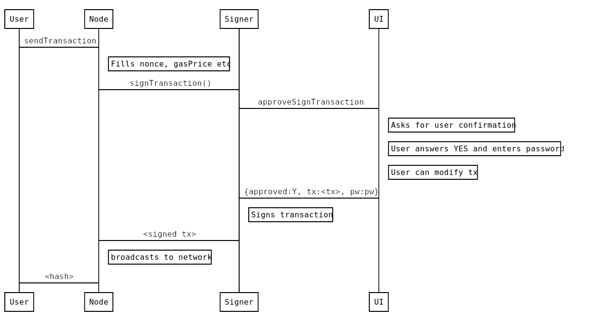

Clef
----
Clef can be used to sign transactions and data and is meant as a replacement for geth's account management.
This allows DApps not to depend on geth's account management. When a DApp wants to sign data it can send the data to
the signer, the signer will then provide the user with context and asks the user for permission to sign the data. If
the users grants the signing request the signer will send the signature back to the DApp.
  
This setup allows a DApp to connect to a remote Ethereum node and send transactions that are locally signed. This can
help in situations when a DApp is connected to a remote node because a local Ethereum node is not available, not
synchronised with the chain or a particular Ethereum node that has no built-in (or limited) account management.
  
Clef can run as a daemon on the same machine, or off a usb-stick like [usb armory](https://inversepath.com/usbarmory),
or a separate VM in a [QubesOS](https://www.qubes-os.org/) type os setup.

Check out 

* the [tutorial](tutorial.md) for some concrete examples on how the signer works.
* the [setup docs](docs/setup.md) for some information on how to configure it to work on QubesOS or USBArmory. 
* the [data types](datatypes.md) for detailed information on the json types used in the communication between
  clef and an external UI 

## Command line flags
Clef accepts the following command line options:
```
COMMANDS:
   init    Initialize the signer, generate secret storage
   attest  Attest that a js-file is to be used
   setpw   Store a credential for a keystore file
   gendoc  Generate documentation about json-rpc format
   help    Shows a list of commands or help for one command
   
GLOBAL OPTIONS:
   --loglevel value        log level to emit to the screen (default: 4)
   --keystore value        Directory for the keystore (default: "$HOME/.ethereum/keystore")
   --configdir value       Directory for Clef configuration (default: "$HOME/.clef")
   --chainid value         Chain id to use for signing (1=mainnet, 3=ropsten, 4=rinkeby, 5=Goerli) (default: 1)
   --lightkdf              Reduce key-derivation RAM & CPU usage at some expense of KDF strength
   --nousb                 Disables monitoring for and managing USB hardware wallets
   --rpcaddr value         HTTP-RPC server listening interface (default: "localhost")
   --rpcvhosts value       Comma separated list of virtual hostnames from which to accept requests (server enforced). Accepts '*' wildcard. (default: "localhost")
   --ipcdisable            Disable the IPC-RPC server
   --ipcpath               Filename for IPC socket/pipe within the datadir (explicit paths escape it)
   --rpc                   Enable the HTTP-RPC server
   --rpcport value         HTTP-RPC server listening port (default: 8550)
   --signersecret value    A file containing the (encrypted) master seed to encrypt Clef data, e.g. keystore credentials and ruleset hash
   --4bytedb value         File containing 4byte-identifiers (default: "./4byte.json")
   --4bytedb-custom value  File used for writing new 4byte-identifiers submitted via API (default: "./4byte-custom.json")
   --auditlog value        File used to emit audit logs. Set to "" to disable (default: "audit.log")
   --rules value           Enable rule-engine (default: "rules.json")
   --stdio-ui              Use STDIN/STDOUT as a channel for an external UI. This means that an STDIN/STDOUT is used for RPC-communication with a e.g. a graphical user interface, and can be used when Clef is started by an external process.
   --stdio-ui-test         Mechanism to test interface between Clef and UI. Requires 'stdio-ui'.
   --advanced              If enabled, issues warnings instead of rejections for suspicious requests. Default off
   --help, -h              show help
   --version, -v           print the version
   
```


Example:
```
signer -keystore /my/keystore -chainid 4
```


## Security model

The security model of the signer is as follows:

* One critical component (the signer binary / daemon) is responsible for handling cryptographic operations: signing, private keys, encryption/decryption of keystore files.
* The signer binary has a well-defined 'external' API.
* The 'external' API is considered UNTRUSTED.
* The signer binary also communicates with whatever process that invoked the binary, via stdin/stdout.
  * This channel is considered 'trusted'. Over this channel, approvals and passwords are communicated.

The general flow for signing a transaction using e.g. geth is as follows:


In this case, `geth` would be started with `--externalsigner=http://localhost:8550` and would relay requests to `eth.sendTransaction`.

## TODOs

Some snags and todos

* [ ] The signer should take a startup param "--no-change", for UIs that do not contain the capability
   to perform changes to things, only approve/deny. Such a UI should be able to start the signer in
   a more secure mode by telling it that it only wants approve/deny capabilities.

* [x] It would be nice if the signer could collect new 4byte-id:s/method selectors, and have a
secondary database for those (`4byte_custom.json`). Users could then (optionally) submit their collections for
inclusion upstream.

* It should be possible to configure the signer to check if an account is indeed known to it, before
passing on to the UI. The reason it currently does not, is that it would make it possible to enumerate
accounts if it immediately returned "unknown account".
* [x] It should be possible to configure the signer to auto-allow listing (certain) accounts, instead of asking every time.
* [x] Done Upon startup, the signer should spit out some info to the caller (particularly important when executed in `stdio-ui`-mode),
invoking methods with the following info:
  * [x] Version info about the signer
  * [x] Address of API (http/ipc)
  * [ ] List of known accounts
* [ ] Have a default timeout on signing operations, so that if the user has not answered within e.g. 60 seconds, the request is rejected.
* [ ] `account_signRawTransaction`
* [ ] `account_bulkSignTransactions([] transactions)` should
   * only exist if enabled via config/flag
   * only allow non-data-sending transactions
   * all txs must use the same `from`-account
   * let the user confirm, showing
      * the total amount
      * the number of unique recipients

* Geth todos
    - The signer should pass the `Origin` header as call-info to the UI. As of right now, the way that info about the request is
put together is a bit of a hack into the http server. This could probably be greatly improved
    - Relay: Geth should be started in `geth --external_signer localhost:8550`.
    - Currently, the Geth APIs use `common.Address` in the arguments to transaction submission (e.g `to` field). This
  type is 20 `bytes`, and is incapable of carrying checksum information. The signer uses `common.MixedcaseAddress`, which
  retains the original input.
    - The Geth api should switch to use the same type, and relay `to`-account verbatim to the external api.

* [x] Storage
    * [x] An encrypted key-value storage should be implemented
    * See [rules.md](rules.md) for more info about this.

* Another potential thing to introduce is pairing.
  * To prevent spurious requests which users just accept, implement a way to "pair" the caller with the signer (external API).
  * Thus geth/mist/cpp would cryptographically handshake and afterwards the caller would be allowed to make signing requests.
  * This feature would make the addition of rules less dangerous.

* Wallets / accounts. Add API methods for wallets.

## Communication

### External API

The signer listens to HTTP requests on `rpcaddr`:`rpcport`, with the same JSONRPC standard as Geth. The messages are
expected to be JSON [jsonrpc 2.0 standard](http://www.jsonrpc.org/specification).

Some of these call can require user interaction. Clients must be aware that responses
may be delayed significantly or may never be received if a users decides to ignore the confirmation request.

The External API is **untrusted** : it does not accept credentials over this api, nor does it expect
that requests have any authority.

### UI API

The signer has one native console-based UI, for operation without any standalone tools.
However, there is also an API to communicate with an external UI. To enable that UI,
the signer needs to be executed with the `--stdio-ui` option, which allocates the
`stdin`/`stdout` for the UI-api.

An example (insecure) proof-of-concept of has been implemented in `pythonsigner.py`.

The model is as follows:

* The user starts the UI app (`pythonsigner.py`).
* The UI app starts the `signer` with `--stdio-ui`, and listens to the
process output for confirmation-requests.
* The `signer` opens the external http api.
* When the `signer` receives requests, it sends a `jsonrpc` request via `stdout`.
* The UI app prompts the user accordingly, and responds to the `signer`
* The `signer` signs (or not), and responds to the original request.

## External API

See the [external api changelog](extapi_changelog.md) for information about changes to this API.

### Encoding
- number: positive integers that are hex encoded
- data: hex encoded data
- string: ASCII string

All hex encoded values must be prefixed with `0x`.

## Methods

### account_new

#### Create new password protected account

The signer will generate a new private key, encrypts it according to [web3 keystore spec](https://github.com/ethereum/wiki/wiki/Web3-Secret-Storage-Definition) and stores it in the keystore directory.
The client is responsible for creating a backup of the keystore. If the keystore is lost there is no method of retrieving lost accounts.

#### Arguments

None

#### Result
  - address [string]: account address that is derived from the generated key
  - url [string]: location of the keyfile
  
#### Sample call
```json
{
  "id": 0,
  "jsonrpc": "2.0",
  "method": "account_new",
  "params": []
}
```
Response
```
{
  "id": 0,
  "jsonrpc": "2.0",
  "result": {
    "address": "0xbea9183f8f4f03d427f6bcea17388bdff1cab133",
    "url": "keystore:///my/keystore/UTC--2017-08-24T08-40-15.419655028Z--bea9183f8f4f03d427f6bcea17388bdff1cab133"
  }
}
```

### account_list

#### List available accounts
   List all accounts that this signer currently manages

#### Arguments

None

#### Result
  - array with account records:
     - account.address [string]: account address that is derived from the generated key
     - account.type [string]: type of the 
     - account.url [string]: location of the account
  
#### Sample call
```json
{
  "id": 1,
  "jsonrpc": "2.0",
  "method": "account_list"
}
```
Response
```
{
  "id": 1,
  "jsonrpc": "2.0",
  "result": [
    {
      "address": "0xafb2f771f58513609765698f65d3f2f0224a956f",
      "type": "account",
      "url": "keystore:///tmp/keystore/UTC--2017-08-24T07-26-47.162109726Z--afb2f771f58513609765698f65d3f2f0224a956f"
    },
    {
      "address": "0xbea9183f8f4f03d427f6bcea17388bdff1cab133",
      "type": "account",
      "url": "keystore:///tmp/keystore/UTC--2017-08-24T08-40-15.419655028Z--bea9183f8f4f03d427f6bcea17388bdff1cab133"
    }
  ]
}
```

### account_signTransaction

#### Sign transactions
   Signs a transactions and responds with the signed transaction in RLP encoded form.

#### Arguments
  2. transaction object:
     - `from` [address]: account to send the transaction from
     - `to` [address]: receiver account. If omitted or `0x`, will cause contract creation.
     - `gas` [number]: maximum amount of gas to burn
     - `gasPrice` [number]: gas price
     - `value` [number:optional]: amount of Wei to send with the transaction
     - `data` [data:optional]:  input data
     - `nonce` [number]: account nonce
  3. method signature [string:optional]
     - The method signature, if present, is to aid decoding the calldata. Should consist of `methodname(paramtype,...)`, e.g. `transfer(uint256,address)`. The signer may use this data to parse the supplied calldata, and show the user. The data, however, is considered totally untrusted, and reliability is not expected.


#### Result
  - signed transaction in RLP encoded form [data]
  
#### Sample call
```json
{
  "id": 2,
  "jsonrpc": "2.0",
  "method": "account_signTransaction",
  "params": [
    {
      "from": "0x1923f626bb8dc025849e00f99c25fe2b2f7fb0db",
      "gas": "0x55555",
      "gasPrice": "0x1234",
      "input": "0xabcd",
      "nonce": "0x0",
      "to": "0x07a565b7ed7d7a678680a4c162885bedbb695fe0",
      "value": "0x1234"
    }
  ]
}
```
Response

```json
{
  "id": 2,
  "jsonrpc": "2.0",
  "error": {
    "code": -32000,
    "message": "Request denied"
  }
}
```
#### Sample call with ABI-data


```json
{
  "id": 67,
  "jsonrpc": "2.0",
  "method": "account_signTransaction",
  "params": [
    {
      "from": "0x694267f14675d7e1b9494fd8d72fefe1755710fa",
      "gas": "0x333",
      "gasPrice": "0x1",
      "nonce": "0x0",
      "to": "0x07a565b7ed7d7a678680a4c162885bedbb695fe0",
      "value": "0x0",
      "data": "0x4401a6e40000000000000000000000000000000000000000000000000000000000000012"
    },
    "safeSend(address)"
  ]
}
```
Response

```json
{
  "jsonrpc": "2.0",
  "id": 67,
  "result": {
    "raw": "0xf88380018203339407a565b7ed7d7a678680a4c162885bedbb695fe080a44401a6e4000000000000000000000000000000000000000000000000000000000000001226a0223a7c9bcf5531c99be5ea7082183816eb20cfe0bbc322e97cc5c7f71ab8b20ea02aadee6b34b45bb15bc42d9c09de4a6754e7000908da72d48cc7704971491663",
    "tx": {
      "nonce": "0x0",
      "gasPrice": "0x1",
      "gas": "0x333",
      "to": "0x07a565b7ed7d7a678680a4c162885bedbb695fe0",
      "value": "0x0",
      "input": "0x4401a6e40000000000000000000000000000000000000000000000000000000000000012",
      "v": "0x26",
      "r": "0x223a7c9bcf5531c99be5ea7082183816eb20cfe0bbc322e97cc5c7f71ab8b20e",
      "s": "0x2aadee6b34b45bb15bc42d9c09de4a6754e7000908da72d48cc7704971491663",
      "hash": "0xeba2df809e7a612a0a0d444ccfa5c839624bdc00dd29e3340d46df3870f8a30e"
    }
  }
}
```

Bash example:
```bash
#curl -H "Content-Type: application/json" -X POST --data '{"jsonrpc":"2.0","method":"account_signTransaction","params":[{"from":"0x694267f14675d7e1b9494fd8d72fefe1755710fa","gas":"0x333","gasPrice":"0x1","nonce":"0x0","to":"0x07a565b7ed7d7a678680a4c162885bedbb695fe0", "value":"0x0", "data":"0x4401a6e40000000000000000000000000000000000000000000000000000000000000012"},"safeSend(address)"],"id":67}' http://localhost:8550/

{"jsonrpc":"2.0","id":67,"result":{"raw":"0xf88380018203339407a565b7ed7d7a678680a4c162885bedbb695fe080a44401a6e4000000000000000000000000000000000000000000000000000000000000001226a0223a7c9bcf5531c99be5ea7082183816eb20cfe0bbc322e97cc5c7f71ab8b20ea02aadee6b34b45bb15bc42d9c09de4a6754e7000908da72d48cc7704971491663","tx":{"nonce":"0x0","gasPrice":"0x1","gas":"0x333","to":"0x07a565b7ed7d7a678680a4c162885bedbb695fe0","value":"0x0","input":"0x4401a6e40000000000000000000000000000000000000000000000000000000000000012","v":"0x26","r":"0x223a7c9bcf5531c99be5ea7082183816eb20cfe0bbc322e97cc5c7f71ab8b20e","s":"0x2aadee6b34b45bb15bc42d9c09de4a6754e7000908da72d48cc7704971491663","hash":"0xeba2df809e7a612a0a0d444ccfa5c839624bdc00dd29e3340d46df3870f8a30e"}}}
```

### account_signData

#### Sign data
   Signs a chunk of data and returns the calculated signature.

#### Arguments
  - content type [string]: type of signed data
     - `text/validator`: hex data with custom validator defined in a contract
     - `application/clique`: [clique](https://github.com/ethereum/EIPs/issues/225) headers
     - `text/plain`: simple hex data validated by `account_ecRecover`
  - account [address]: account to sign with
  - data [object]: data to sign

#### Result
  - calculated signature [data]
  
#### Sample call
```json
{
  "id": 3,
  "jsonrpc": "2.0",
  "method": "account_signData",
  "params": [
    "data/plain",
    "0x1923f626bb8dc025849e00f99c25fe2b2f7fb0db",
    "0xaabbccdd"
  ]
}
```
Response

```json
{
  "id": 3,
  "jsonrpc": "2.0",
  "result": "0x5b6693f153b48ec1c706ba4169960386dbaa6903e249cc79a8e6ddc434451d417e1e57327872c7f538beeb323c300afa9999a3d4a5de6caf3be0d5ef832b67ef1c"
}
```

### account_signTypedData

#### Sign data
   Signs a chunk of structured data conformant to [EIP712]([EIP-712](https://github.com/ethereum/EIPs/blob/master/EIPS/eip-712.md)) and returns the calculated signature.

#### Arguments
  - account [address]: account to sign with
  - data [object]: data to sign

#### Result
  - calculated signature [data]
  
#### Sample call
```json
{
  "id": 68,
  "jsonrpc": "2.0",
  "method": "account_signTypedData",
  "params": [
    "0xcd2a3d9f938e13cd947ec05abc7fe734df8dd826",
    {
      "types": {
        "EIP712Domain": [
          {
            "name": "name",
            "type": "string"
          },
          {
            "name": "version",
            "type": "string"
          },
          {
            "name": "chainId",
            "type": "uint256"
          },
          {
            "name": "verifyingContract",
            "type": "address"
          }
        ],
        "Person": [
          {
            "name": "name",
            "type": "string"
          },
          {
            "name": "wallet",
            "type": "address"
          }
        ],
        "Mail": [
          {
            "name": "from",
            "type": "Person"
          },
          {
            "name": "to",
            "type": "Person"
          },
          {
            "name": "contents",
            "type": "string"
          }
        ]
      },
      "primaryType": "Mail",
      "domain": {
        "name": "Ether Mail",
        "version": "1",
        "chainId": 1,
        "verifyingContract": "0xCcCCccccCCCCcCCCCCCcCcCccCcCCCcCcccccccC"
      },
      "message": {
        "from": {
          "name": "Cow",
          "wallet": "0xCD2a3d9F938E13CD947Ec05AbC7FE734Df8DD826"
        },
        "to": {
          "name": "Bob",
          "wallet": "0xbBbBBBBbbBBBbbbBbbBbbbbBBbBbbbbBbBbbBBbB"
        },
        "contents": "Hello, Bob!"
      }
    }
  ]
}
```
Response

```json
{
    "id": 1,
    "jsonrpc": "2.0",
    "result": "0x4355c47d63924e8a72e509b65029052eb6c299d53a04e167c5775fd466751c9d07299936d304c153f6443dfa05f40ff007d72911b6f72307f996231605b915621c"
}
```

### account_ecRecover

#### Sign data

Derive the address from the account that was used to sign data with content type `text/plain` and the signature.

#### Arguments
  - data [data]: data that was signed
  - signature [data]: the signature to verify

#### Result
  - derived account [address]
  
#### Sample call
```json
{
  "id": 4,
  "jsonrpc": "2.0",
  "method": "account_ecRecover",
  "params": [
    "data/plain",
    "0xaabbccdd",
    "0x5b6693f153b48ec1c706ba4169960386dbaa6903e249cc79a8e6ddc434451d417e1e57327872c7f538beeb323c300afa9999a3d4a5de6caf3be0d5ef832b67ef1c"
  ]
}
```
Response

```json
{
  "id": 4,
  "jsonrpc": "2.0",
  "result": "0x1923f626bb8dc025849e00f99c25fe2b2f7fb0db"
}
```

### account_import

#### Import account
   Import a private key into the keystore. The imported key is expected to be encrypted according to the web3 keystore
   format.
   
#### Arguments
  - account [object]: key in [web3 keystore format](https://github.com/ethereum/wiki/wiki/Web3-Secret-Storage-Definition) (retrieved with account_export) 

#### Result
  - imported key [object]:
     - key.address [address]: address of the imported key
     - key.type [string]: type of the account
     - key.url [string]: key URL
  
#### Sample call
```json
{
  "id": 6,
  "jsonrpc": "2.0",
  "method": "account_import",
  "params": [
    {
      "address": "c7412fc59930fd90099c917a50e5f11d0934b2f5",
      "crypto": {
        "cipher": "aes-128-ctr",
        "cipherparams": {
          "iv": "401c39a7c7af0388491c3d3ecb39f532"
        },
        "ciphertext": "eb045260b18dd35cd0e6d99ead52f8fa1e63a6b0af2d52a8de198e59ad783204",
        "kdf": "scrypt",
        "kdfparams": {
          "dklen": 32,
          "n": 262144,
          "p": 1,
          "r": 8,
          "salt": "9a657e3618527c9b5580ded60c12092e5038922667b7b76b906496f021bb841a"
        },
        "mac": "880dc10bc06e9cec78eb9830aeb1e7a4a26b4c2c19615c94acb632992b952806"
      },
      "id": "09bccb61-b8d3-4e93-bf4f-205a8194f0b9",
      "version": 3
    }
  ]
}
```
Response

```json
{
  "id": 6,
  "jsonrpc": "2.0",
  "result": {
    "address": "0xc7412fc59930fd90099c917a50e5f11d0934b2f5",
    "type": "account",
    "url": "keystore:///tmp/keystore/UTC--2017-08-24T11-00-42.032024108Z--c7412fc59930fd90099c917a50e5f11d0934b2f5"
  }
}
```

### account_export

#### Export account from keystore
   Export a private key from the keystore. The exported private key is encrypted with the original passphrase. When the
   key is imported later this passphrase is required.
   
#### Arguments
  - account [address]: export private key that is associated with this account

#### Result
  - exported key, see [web3 keystore format](https://github.com/ethereum/wiki/wiki/Web3-Secret-Storage-Definition) for
  more information
  
#### Sample call
```json
{
  "id": 5,
  "jsonrpc": "2.0",
  "method": "account_export",
  "params": [
    "0xc7412fc59930fd90099c917a50e5f11d0934b2f5"
  ]
}
```
Response

```json
{
  "id": 5,
  "jsonrpc": "2.0",
  "result": {
    "address": "c7412fc59930fd90099c917a50e5f11d0934b2f5",
    "crypto": {
      "cipher": "aes-128-ctr",
      "cipherparams": {
        "iv": "401c39a7c7af0388491c3d3ecb39f532"
      },
      "ciphertext": "eb045260b18dd35cd0e6d99ead52f8fa1e63a6b0af2d52a8de198e59ad783204",
      "kdf": "scrypt",
      "kdfparams": {
        "dklen": 32,
        "n": 262144,
        "p": 1,
        "r": 8,
        "salt": "9a657e3618527c9b5580ded60c12092e5038922667b7b76b906496f021bb841a"
      },
      "mac": "880dc10bc06e9cec78eb9830aeb1e7a4a26b4c2c19615c94acb632992b952806"
    },
    "id": "09bccb61-b8d3-4e93-bf4f-205a8194f0b9",
    "version": 3
  }
}
```


## UI API

These methods needs to be implemented by a UI listener.

By starting the signer with the switch `--stdio-ui-test`, the signer will invoke all known methods, and expect the UI to respond with
denials. This can be used during development to ensure that the API is (at least somewhat) correctly implemented.
See `pythonsigner`, which can be invoked via `python3 pythonsigner.py test` to perform the 'denial-handshake-test'.

All methods in this API uses object-based parameters, so that there can be no mixups of parameters: each piece of data is accessed by key.

See the [ui api changelog](intapi_changelog.md) for information about changes to this API.

OBS! A slight deviation from `json` standard is in place: every request and response should be confined to a single line.
Whereas the `json` specification allows for linebreaks, linebreaks __should not__ be used in this communication channel, to make
things simpler for both parties.

### ApproveTx / `ui_approveTx`

Invoked when there's a transaction for approval.


#### Sample call

Here's a method invocation:
```bash

curl -i -H "Content-Type: application/json" -X POST --data '{"jsonrpc":"2.0","method":"account_signTransaction","params":[{"from":"0x694267f14675d7e1b9494fd8d72fefe1755710fa","gas":"0x333","gasPrice":"0x1","nonce":"0x0","to":"0x07a565b7ed7d7a678680a4c162885bedbb695fe0", "value":"0x0", "data":"0x4401a6e40000000000000000000000000000000000000000000000000000000000000012"},"safeSend(address)"],"id":67}' http://localhost:8550/
```
Results in the following invocation on the UI:
```json

{
  "jsonrpc": "2.0",
  "id": 1,
  "method": "ui_approveTx",
  "params": [
    {
      "transaction": {
        "from": "0x0x694267f14675d7e1b9494fd8d72fefe1755710fa",
        "to": "0x0x07a565b7ed7d7a678680a4c162885bedbb695fe0",
        "gas": "0x333",
        "gasPrice": "0x1",
        "value": "0x0",
        "nonce": "0x0",
        "data": "0x4401a6e40000000000000000000000000000000000000000000000000000000000000012",
        "input": null
      },
      "call_info": [
          {
            "type": "WARNING",
            "message": "Invalid checksum on to-address"
          },
          {
            "type": "Info",
            "message": "safeSend(address: 0x0000000000000000000000000000000000000012)"
          }
        ],
      "meta": {
        "remote": "127.0.0.1:48486",
        "local": "localhost:8550",
        "scheme": "HTTP/1.1"
      }
    }
  ]
}

```

The same method invocation, but with invalid data:
```bash

curl -i -H "Content-Type: application/json" -X POST --data '{"jsonrpc":"2.0","method":"account_signTransaction","params":[{"from":"0x694267f14675d7e1b9494fd8d72fefe1755710fa","gas":"0x333","gasPrice":"0x1","nonce":"0x0","to":"0x07a565b7ed7d7a678680a4c162885bedbb695fe0", "value":"0x0", "data":"0x4401a6e40000000000000002000000000000000000000000000000000000000000000012"},"safeSend(address)"],"id":67}' http://localhost:8550/
```

```json

{
  "jsonrpc": "2.0",
  "id": 1,
  "method": "ui_approveTx",
  "params": [
    {
      "transaction": {
        "from": "0x0x694267f14675d7e1b9494fd8d72fefe1755710fa",
        "to": "0x0x07a565b7ed7d7a678680a4c162885bedbb695fe0",
        "gas": "0x333",
        "gasPrice": "0x1",
        "value": "0x0",
        "nonce": "0x0",
        "data": "0x4401a6e40000000000000002000000000000000000000000000000000000000000000012",
        "input": null
      },
      "call_info": [
          {
            "type": "WARNING",
            "message": "Invalid checksum on to-address"
          },
          {
            "type": "WARNING",
            "message": "Transaction data did not match ABI-interface: WARNING: Supplied data is stuffed with extra data. \nWant 0000000000000002000000000000000000000000000000000000000000000012\nHave 0000000000000000000000000000000000000000000000000000000000000012\nfor method safeSend(address)"
          }
        ],
      "meta": {
        "remote": "127.0.0.1:48492",
        "local": "localhost:8550",
        "scheme": "HTTP/1.1"
      }
    }
  ]
}


```

One which has missing `to`, but with no `data`:


```json

{
  "jsonrpc": "2.0",
  "id": 3,
  "method": "ui_approveTx",
  "params": [
    {
      "transaction": {
        "from": "",
        "to": null,
        "gas": "0x0",
        "gasPrice": "0x0",
        "value": "0x0",
        "nonce": "0x0",
        "data": null,
        "input": null
      },
      "call_info": [
          {
            "type": "CRITICAL",
            "message": "Tx will create contract with empty code!"
          }
        ],
      "meta": {
        "remote": "signer binary",
        "local": "main",
        "scheme": "in-proc"
      }
    }
  ]
}
```

### ApproveListing / `ui_approveListing`

Invoked when a request for account listing has been made.

#### Sample call

```json

{
  "jsonrpc": "2.0",
  "id": 5,
  "method": "ui_approveListing",
  "params": [
    {
      "accounts": [
        {
          "type": "Account",
          "url": "keystore:///home/bazonk/.ethereum/keystore/UTC--2017-11-20T14-44-54.089682944Z--123409812340981234098123409812deadbeef42",
          "address": "0x123409812340981234098123409812deadbeef42"
        },
        {
          "type": "Account",
          "url": "keystore:///home/bazonk/.ethereum/keystore/UTC--2017-11-23T21-59-03.199240693Z--cafebabedeadbeef34098123409812deadbeef42",
          "address": "0xcafebabedeadbeef34098123409812deadbeef42"
        }
      ],
      "meta": {
        "remote": "signer binary",
        "local": "main",
        "scheme": "in-proc"
      }
    }
  ]
}

```


### ApproveSignData / `ui_approveSignData`

#### Sample call

```json
{
  "jsonrpc": "2.0",
  "id": 4,
  "method": "ui_approveSignData",
  "params": [
    {
      "address": "0x123409812340981234098123409812deadbeef42",
      "raw_data": "0x01020304",
      "message": "\u0019Ethereum Signed Message:\n4\u0001\u0002\u0003\u0004",
      "hash": "0x7e3a4e7a9d1744bc5c675c25e1234ca8ed9162bd17f78b9085e48047c15ac310",
      "meta": {
        "remote": "signer binary",
        "local": "main",
        "scheme": "in-proc"
      }
    }
  ]
}

```

### ShowInfo / `ui_showInfo`

The UI should show the info to the user. Does not expect response.

#### Sample call

```json
{
  "jsonrpc": "2.0",
  "id": 9,
  "method": "ui_showInfo",
  "params": [
    {
      "text": "Tests completed"
    }
  ]
}

```

### ShowError / `ui_showError`

The UI should show the info to the user. Does not expect response.

```json

{
  "jsonrpc": "2.0",
  "id": 2,
  "method": "ShowError",
  "params": [
    {
      "text": "Testing 'ShowError'"
    }
  ]
}

```

### OnApprovedTx / `ui_onApprovedTx`

`OnApprovedTx` is called when a transaction has been approved and signed. The call contains the return value that will be sent to the external caller.  The return value from this method is ignored - the reason for having this callback is to allow the ruleset to keep track of approved transactions.

When implementing rate-limited rules, this callback should be used.

TLDR; Use this method to keep track of signed transactions, instead of using the data in `ApproveTx`.

### OnSignerStartup / `ui_onSignerStartup`

This method provide the UI with information about what API version the signer uses (both internal and external) aswell as build-info and external api,
in k/v-form.

Example call:
```json

{
  "jsonrpc": "2.0",
  "id": 1,
  "method": "ui_onSignerStartup",
  "params": [
    {
      "info": {
        "extapi_http": "http://localhost:8550",
        "extapi_ipc": null,
        "extapi_version": "2.0.0",
        "intapi_version": "1.2.0"
      }
    }
  ]
}

```


### Rules for UI apis

A UI should conform to the following rules.

* A UI MUST NOT load any external resources that were not embedded/part of the UI package.
  * For example, not load icons, stylesheets from the internet
  * Not load files from the filesystem, unless they reside in the same local directory (e.g. config files)
* A Graphical UI MUST show the blocky-identicon for ethereum addresses.
* A UI MUST warn display approproate warning if the destination-account is formatted with invalid checksum.
* A UI MUST NOT open any ports or services
  * The signer opens the public port
* A UI SHOULD verify the permissions on the signer binary, and refuse to execute or warn if permissions allow non-user write.
* A UI SHOULD inform the user about the `SHA256` or `MD5` hash of the binary being executed
* A UI SHOULD NOT maintain a secondary storage of data, e.g. list of accounts
  * The signer provides accounts
* A UI SHOULD, to the best extent possible, use static linking / bundling, so that required libraries are bundled
along with the UI.


### UI Implementations 

There are a couple of implementation for a UI. We'll try to keep this list up to date. 

| Name | Repo | UI type| No external resources| Blocky support| Verifies permissions | Hash information | No secondary storage | Statically linked| Can modify parameters|
| ---- | ---- | -------| ---- | ---- | ---- |---- | ---- | ---- | ---- |
| QtSigner| https://github.com/holiman/qtsigner/| Python3/QT-based| :+1:| :+1:| :+1:| :+1:| :+1:| :x: |  :+1: (partially)|
| GtkSigner| https://github.com/holiman/gtksigner| Python3/GTK-based| :+1:| :x:| :x:| :+1:| :+1:| :x: |  :x: |
| Frame | https://github.com/floating/frame/commits/go-signer| Electron-based| :x:| :x:| :x:| :x:| ?| :x: |  :x: |
| Clef UI| https://github.com/kyokan/clef-ui| Golang/QT-based| :+1:| :+1:| :x:| :+1:| :+1:| :x: |  :+1: (approve tx only)|
