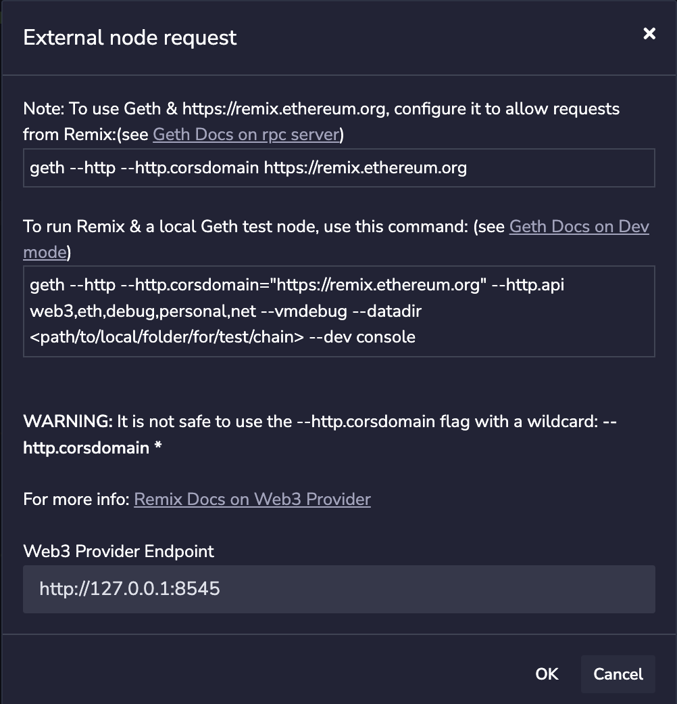

Geth has a development mode that sets up a single node Ethereum test network with options 
optimized for developing on local machines. You enable it with the `--dev` argument.

Starting geth in dev mode does the following:

- Initializes the data directory with a testing genesis block
- Sets max peers to 0
- Turns off discovery by other nodes
- Sets the gas price to 0
- It uses the Clique PoA consensus engine, allowing blocks to be mined as needed without excessive CPU and memory consumption.
- Uses on-demand block generation, producing blocks when transactions are waiting to be mined
- Creates a pre-funded developer account
- Enable [RPC](../../_rpc/server.md) so you can connect other applications to geth.

## Start Geth in Dev Mode


To start geth in dev mode, you specify a data directory to maintain the 
state between runs using `--datadir` flag.

```shell
geth --datadir geth-test --http --dev
```

Geth creates this directory `geth-test` if it doesn't exist. For an already existing directory, 
geth will ask for the account's password. If not found will throw an error.

```shell
Fatal: Failed to unlock developer account: could not decrypt key with given password.
```

To resolve this issue, create a .txt file, put your account password, 
and then use this `--password` flag to specify the password location. 

```shell
geth --datadir geth-tutorial --password password.txt --http --dev 
```

The `geth-tutorial` is an existing directory with an account.

> Note this solution is not recommended.

Once geth is running in dev mode, you can interact with it using the RPC server and IPC.

### Check accounts in RPC:

```shell
curl -X POST http://127.0.0.1:8545 \
    -H "Content-Type: application/json" \
   --data '{"jsonrpc":"2.0", "method":"eth_accounts","params":[], "id":5}'
```

### Connect to the IPC console 

```shell
geth attach <IPC_LOCATION>
```

Create a test account:

```shell
> personal.newAccount()
```

And transfer ether from the coinbase to the new account:

```shell
> eth.sendTransaction({from:eth.coinbase, to:eth.accounts[1], value: web3.toWei(0.05, "ether")})
```

And check the balance of the account:

```shell
> eth.getBalance(eth.accounts[1])
```

If you want to test your dapps with a realistic block time use the `--dev.period` 
option when you start dev mode with the `--dev.period 14` argument.

## Connect Remix to Geth

In this guide, you will learn how to connect geth to Remix.
With geth now running in dev mode, follow the steps below to see contract 
creation, mining, and transaction activity.

**1:** Open https://remix.ethereum.org. 

**2:** Select a contract to compile

**3:** Click on DEPLOY & RUN TRANSACTIONS, select Web3 Provider from the Environment dropdown, and click the deploy button. You will see a pop message.



Click "ok" and deploy again, then check your terminal running geth.


```terminal

INFO [02-24|16:05:46.305] Commit new mining work                   number=1 sealhash=4b04e6..ea47a5 uncles=0 txs=0 gas=0 fees=0 elapsed="78.216µs"
WARN [02-24|16:05:46.305] Block sealing failed                     err="sealing paused while waiting for transactions"
INFO [02-24|16:27:19.998] Setting new local account                address=0xca57F3b40B42FCce3c37B8D18aDBca5260ca72EC
INFO [02-24|16:27:20.000] Submitted contract creation              hash=0x4d0f7d6fb167088c56133dca7bce8205bb3c2285ef484eecc19f41101f55432b from=0xca57F3b40B42FCce3c37B8D18aDBca5260ca72EC nonce=0 contract=0x2aBF40aC0662DaA1116D2b103970059FaF5FCFEa value=0
INFO [02-24|16:27:20.000] Commit new mining work                   number=1 sealhash=32ed20..3c076c uncles=0 txs=1 gas=368,939 fees=0.0009223475 elapsed="351.288µs"
INFO [02-24|16:27:20.000] Successfully sealed new block            number=1 sealhash=32ed20..3c076c hash=bc3cc6..1befd9 elapsed="509.198µs"
INFO [02-24|16:27:20.000] 🔨 mined potential block                  number=1 hash=bc3cc6..1befd9
INFO [02-24|16:27:20.001] Commit new mining work                   number=2 sealhash=a34261..bb987e uncles=0 txs=0 gas=0       fees=0            elapsed="217.474µs"
WARN [02-24|16:27:20.001] Block sealing failed                     err="sealing paused while waiting for transactions"
INFO [02-24|16:28:44.268] Submitted transaction                    hash=0x29b986b32aecc692781b09c18461b803d7446ed1a123f918aae658c87f12fedf from=0xca57F3b40B42FCce3c37B8D18aDBca5260ca72EC nonce=1 recipient=0x2aBF40aC0662DaA1116D2b103970059FaF5FCFEa value=0
```
