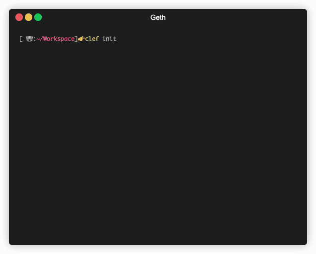

To use Geth, you need to install it first. You can install Geth in a variety
of ways that you can find in the "[Install and Build](install-and-build/installing-geth)" section.
These include installing it via your favorite package manager, downloading a
standalone pre-built binary, running it as a docker container or building it yourself.

For this guide, we assume you have Geth installed and are ready to find out how to use it.
The guide shows you how to create accounts, sync to a network, and then send transactions
between accounts.

This guide uses [Clef](clef/tutorial), which is our preferred tool for signing transactions with Geth,
and will replace Geth's account management.

## Initialize Clef

First, initialize Clef with a random master seed, which is also encrypted with the password you define.
The password must be at least 10 characters.

```shell
clef init
```



## Create accounts

Create two accounts with the `clef newaccount` command,
set a password for each of them, and note the public address for each.


Clef outputs a debug message about `Failed to reload keystore contents`, we fix that in a later step.

## Start Geth

### Networks

You can connect a Geth node to several different networks using the network name as an argument.
These include the main Ethereum network, [a private network](getting-started/private-net) you create,
and three test networks that use different consensus algorithms:

-   **Ropsten**: Proof-of-work test network
-   **Rinkeby**: Proof-of-authority test network
-   **Görli**: Proof-of-authority test network

For this guide, we use the Görli network. The default port is 30303, so you need to enable at least
outgoing access from your node to that port.

### Sync modes

You can start Geth in one of three different sync modes using the `--syncmode "<mode>"`
argument that determines what sort of node it is in the network.

These are:

- **Full**: Downloads all blocks (including headers, transactions, and receipts) and
generates the state of the blockchain incrementally by executing every block.
- **Fast**: Downloads all blocks (including headers, transactions and
receipts), verifies all headers, and downloads the state and verifies it against the
headers.
- **Snap** (Default): Same functionality as fast, but with a faster algorithm.   
- **Light**: Downloads all block headers, block data, and verifies some randomly.

For this tutorial, we use a `light` sync:


## Start Clef

Start Clef, setting the keystore and chain id (goerli is 5) for the network we want to connect to:

```shell
clef --keystore <GETH_DATA_DIR>/keystore --chainid 5
```

To begin with, you see errors about a missing keystore, and we fix that soon.

Under Linux the default Geth data directory is `~/.ethereum`

## Start Geth

Open another command line window and run command below, which also enables the 
[Geth RPC interface](clef/tutorial) (see below), and sets Clef as the transaction signer.

```shell
geth --goerli --syncmode "light" --http --signer=<CLEF_LOCATION>/clef.ipc
```

By default Clef's location under Linux is `~/.clef`, but the signer's location cannot
include a `~` so replace it with your home directory.

## Get ETH

Unless you have Ether in another account on the Görli network, you can use a
[faucet](https://goerli-faucet.slock.it/) to send ETH to one of your new account addresses to use for this guide.

## Connect to Geth with IPC or RPC

You can interact with Geth in two ways: Directly with the node using the JavaScript
console over IPC, or connecting to the node remotely over HTTP using RPC.

IPC allows you to do more, especially when it comes to creating and interacting
with accounts, but you need direct access to the node.

RPC allows remote applications to access your node but has limitations and security
considerations, and by default only allows access to methods in the `eth` and `shh`
namespaces. Find out how to override this setting [in the RPC docs](rpc/server#http-server).

## Using IPC

### Connect to console

Connect to the IPC console on a node from another terminal window:

```shell
geth attach <IPC_LOCATION>
```

You can see the IPC location in the output of the network node `geth` process. By default, when using
Görli, it is `~/.ethereum/goerli/geth.ipc`.

### Check account balance

```javascript
web3.fromWei(eth.getBalance("<ADDRESS_1>"),"ether")
```

Getting the balance of an account does not require a signed transaction,
so Clef does not ask for approval, and Geth returns the value.

Note that this step requires the initial synchronization to end. If you get an error message, return to the 
console with the network node Geth and wait until it is synchronized. You
know that your Geth is synchronized when it is only importing a small number of blocks (one or two, usually)
at a time.

### Send ETH to account

Send 0.01 ETH from the account that you added ETH to with the Görli faucet,
to the second account you created:

```javascript
eth.sendTransaction({from:"<ADDRESS_1>",to:"<ADDRESS_2>", value: web3.toWei(0.01,"ether")})
```

This action does require signing the transaction, so go to the command line window with Clef running 
to see that Clef prompts you to approve it, and when you do, asks you for the password for the account you are 
sending the ETH from. If the password is correct, Geth proceeds with the transaction.

To check, get the account balance of the second account:

```javascript
web3.fromWei(eth.getBalance("<ADDRESS_2>"),"ether")
```

## Using RPC

### Connect to RPC

You can use standard HTTP requests to connect to a Geth node using the RPC APIs, using
this syntax:

```shell
curl -X POST http://<GETH_IP_ADDRESS>:8545 \
    -H "Content-Type: application/json" \
   --data'{"jsonrpc":"2.0", "method":"<API_METHOD>", "params":[], "id":1}'
```

### Check account balance

```shell
curl -X POST http://<GETH_IP_ADDRESS>:8545 \
    -H "Content-Type: application/json" \
   --data '{"jsonrpc":"2.0", "method":"eth_getBalance", "params":["<ADDRESS_1>","latest"], "id":1}'
```

Getting the balance of an account does not require a signed transaction, so Geth returns the value without invoking
Clef. Note that the value returned is in hexadecimal and WEI. To get the ETH value, convert to decimal and divide by 10^18.

### Send ETH to accounts

Send 0.01 ETH from the account that you added ETH to with the Görli faucet, to the second account you created:

```shell
curl -X POST http://<GETH_IP_ADDRESS>:8545 \
    -H "Content-Type: application/json" \
   --data '{"jsonrpc":"2.0", "method":"eth_sendTransaction", "params":[{"from": "<ADDRESS_1>","to": "<ADDRESS_2>","value": "0x9184e72a"}], "id":1}'
```

This action does require signing, so Clef prompts you to approve it, and if you do,
asks you for the password of the account from which you are sending the ETH. If the password is correct,
Geth proceeds with the transaction.

To check, get the account balance of the second account:

```shell
curl -X POST http://<GETH_IP_ADDRESS>:8545 \
    -H "Content-Type: application/json" \
    --data '{"jsonrpc":"2.0", "method":"eth_getBalance", "params":["<ADDRESS_2>","latest"], "id":1}'
```
