To use Geth, you need to install it first. You can install Geth in a variety of ways that you can find in the “[Install and Build](install-and-build/installing-geth)” section. 
These include installing it via your favorite package manager, downloading a standalone pre-built binary, running it as a docker container, or building it yourself.

For this guide, we assume you have Geth installed and are ready to find out how to use it. 
The guide shows you how to create accounts, sync to a network, and then send transactions between accounts.
This guide uses [Clef](clef/tutorial), which is our preferred tool for signing transactions with Geth, and will replace Geth’s account management.

## Two Important terms in geth:

### Networks
You can connect a Geth node to several different networks using the network name as an argument. These include the main Ethereum network, [a private network](getting-started/private-net) you create, and three test networks that use different consensus algorithms:

-   Ropsten: Proof-of-work test network
-   Rinkeby: Proof-of-authority test network
-   Görli: Proof-of-authority test network

For this guide, you will use the Görli network. The default port is 8545, so you need to enable at least outgoing access from your node to that port.
### Sync modes
You can start Geth in one of three different sync modes using the `--syncmode "<mode>"` argument that determines what sort of node it is in the network.
These are:

- Full: Downloads all blocks (including headers, transactions, and receipts) and generates the state of the blockchain incrementally by executing every block.
- Snap (Default): Same functionality as fast, but with a faster algorithm.
- Light: Downloads all block headers, block data, and verifies some randomly.

For this tutorial, you will use a `light` sync:

### Prerequisites:

- Curl experience 
- Command line
- Basic Blockchain Knowledge

## Step 1: Open Terminal
You will need your system terminal to run the commands for this tutorial.

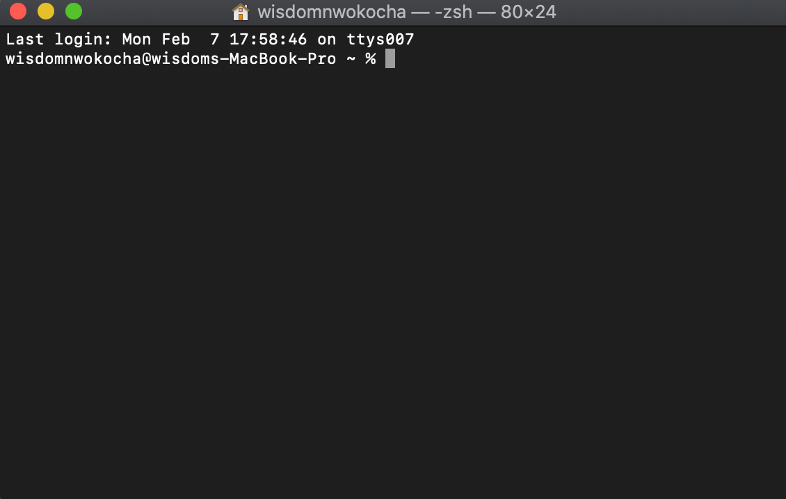
## Step 2: Create accounts

Use the command below to create an account 
> **Note:** you will need to create two accounts for this guide

```shell
clef newaccount --keystore geth-tutorial/keystore
```

It will give you the result below:

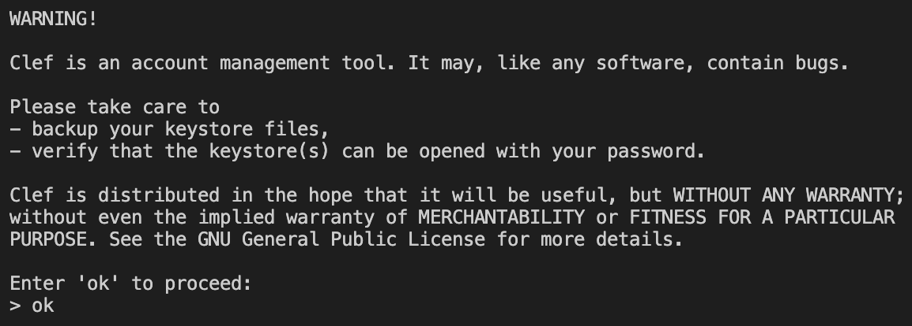

Enter “ok” and hit the enter key. Next, the system will request the below action.
**Please enter a password for the new account to be created (attempt 0 of 3)**
Enter your desired password and hit the enter key to get the result below:

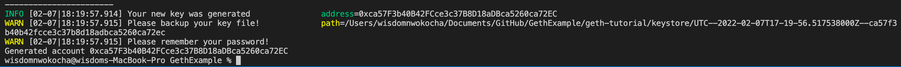

Copy and save your password and generated account somewhere safe; you will need it later in this tutorial.

**The Generated account:**
```shell
0xca57F3b40B42FCce3c37B8D18aDBca5260ca72EC
```
## Step 3:  Start Clef

To start clef, open a new terminal and run the command below. Keeping clef running is required for the other steps to work.

```shell
clef --keystore geth-tutorial/keystore --configdir geth-tutorial/clef --chainid 5
```

> Note:  geth-tutorial folder is the directory holding your keystore

after running the command above, the system will request you to type “ok” to proceed

A successful call will give you the result below:

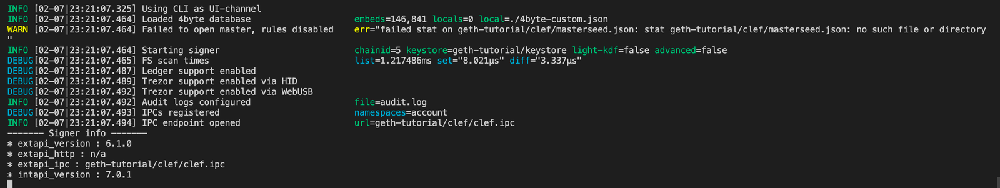

> **Note:** keep this terminal open.

## Step 4:  Start Geth
To start geth, open a new terminal and run the command below. It would be best if you did not close this terminal, always keep it running while working.

```shell
geth --datadir geth-tutorial --signer=geth-tutorial/clef/clef.ipc --goerli --syncmode "light" --http
```


A successful call will give you the result below:

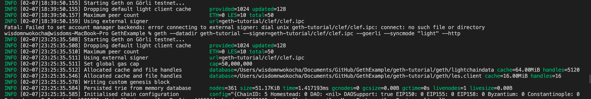

> **Note:** keep this terminal open.


## Step 5:  Get Goerli Testet Ether

The primary purpose of the faucet is to fund your testnet account to pay for gas fees for testing your project. 

The following sites gives free goerli faucets:

- [faucet 1](https://faucets.chain.link/goerli)
- [faucet 2](https://fauceth.komputing.org/?chain=5)

## Step 6: Interact with Geth via IPC or RPC

You can interact with Geth in two ways: Directly with the node using the JavaScript console over IPC or connecting to the node remotely over HTTP using RPC.

- IPC (Inter-Process Communication):
    allows you to do more, especially when creating and interacting with accounts, but you need direct access to the node.
- RPC (Remote Procedure Call):
     allows remote applications to access your node but has limitations and security considerations, and by default, only allows access to methods in the eth and shh namespaces. Find out how to override this setting [in the RPC docs](rpc/server#http-server).

## Step 7: Using IPC

**→ Connect to console**
Connect to the IPC console on a node from another terminal window, this will open the Geth javascript console
run the command below

```shell
geth attach http://127.0.0.1:8545
```

Result after running the above command: 

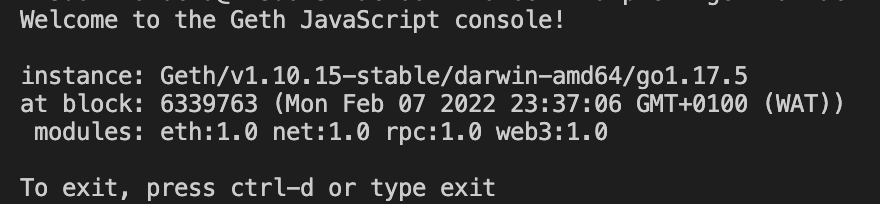


**→ Check account balance**

> **Note:** the value comes in wei
**Syntax:**

```shell
web3.fromWei(eth.getBalance("<ADDRESS_1>"),"ether")
```

Run the command below to check your account balance

```
web3.fromWei(eth.getBalance("0xca57F3b40B42FCce3c37B8D18aDBca5260ca72EC"),"ether")
```

**Result:**

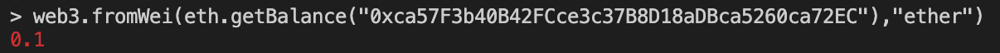


**→ Check list of accounts**

**step 1:**
Run the command below to get the list of accounts in your keystore
 ```javascript
 eth.accounts
 ```

**step 2:** Accept request in your Clef terminal 

The command in step 1 will need approval from the terminal running clef, before showing the list of accounts.

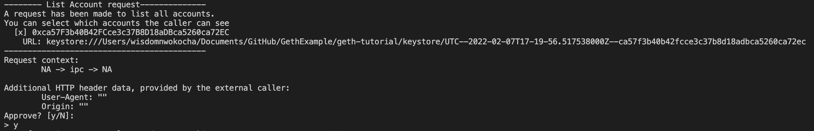


Approve the request by typing “y” and hit the enter key.

**Result:**


**→ Send ETH to account**

Send 0.01 ETH from the account that you added ETH to with the Görli faucet, to the second account you created.

**Syntax:**

```shell
eth.sendTransaction({from:"<ADDRESS_1>",to:"<ADDRESS_2>", value: web3.toWei(0.01,"ether")})
```

**step 1:** 
Run the command below to transfer 0.01 ether to the other account you created

```javscript
eth.sendTransaction({
    from:"0xca57f3b40b42fcce3c37b8d18adbca5260ca72ec",
    to:"0x8EB19d8DF81a8B43a178207E23E9a57ff8cA61B1", 
    value: web3.toWei(0.01,"ether")
    })
```

**step 2:**
Accept request in your Clef terminal 

After running in step 1 command, Clef will prompt you to approve the transaction, and when you do, it will ask you for the password for the account you are sending the ETH from; if the password is correct, Geth proceeds with the transaction.

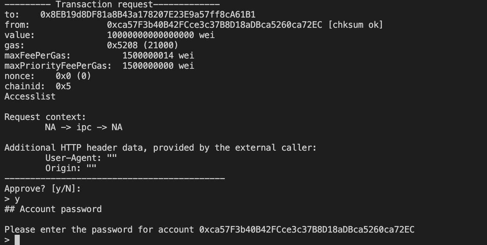


After approving the transaction you will see the below screen in the Clef terminal

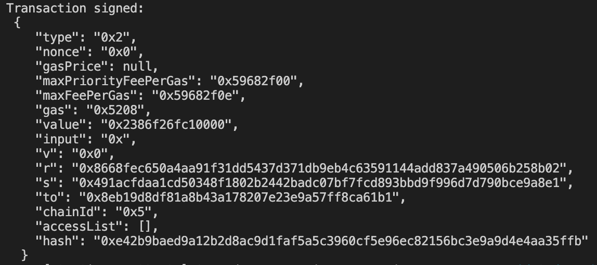


**Step 1** Terminal Result, it will return a response that includes the transaction hash:

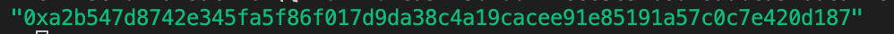


**→ Check Transaction hash**

**Syntax:**

```shell
eth.getTransaction("hash id")
```

A Transaction Hash (Tx Hash) is a record of successful transaction in a blockchain that can be accessed with unique address.

Run the command below.

```javscript
eth.getTransaction("0xa2b547d8742e345fa5f86f017d9da38c4a19cacee91e85191a57c0c7e420d187")
```

If successful, you will get the below response 

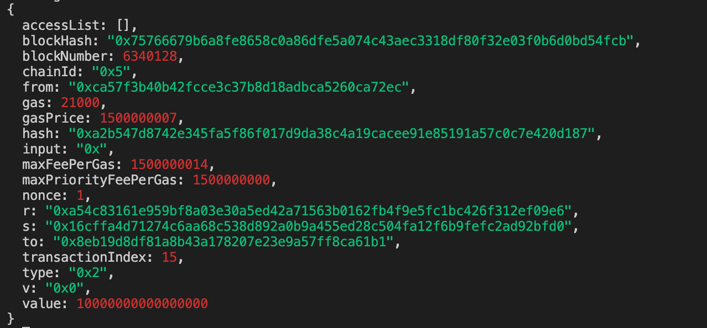

## Step 7: Using RPC

**→ Check account balance**

**Syntax:**

```shell
    curl -X POST http://http://127.0.0.1:8545 \
        -H "Content-Type: application/json" \
       --data '{"jsonrpc":"2.0", "method":"eth_getBalance", "params":["<ADDRESS_1>","latest"], "id":1}'
```
 
 > **Note:** http://127.0.0.1:8545 this is the default address
 
 To check your account balance use the command below.

 ```shell
  curl -X POST http://127.0.0.1:8545 \
    -H "Content-Type: application/json" \
   --data '{"jsonrpc":"2.0", "method":"eth_getBalance", "params":["0xca57f3b40b42fcce3c37b8d18adbca5260ca72ec","latest"], "id":5}'
   ```

A successful call will return a response below:

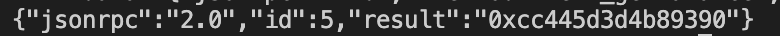


So Geth returns the value without invoking Clef. Note that the value returned is in hexadecimal and WEI. To get the ETH value, convert to decimal and divide by 10^18.

**→ Check list of accounts**

Run the command below to get all the accounts.

```shell
curl -X POST http://127.0.0.1:8545 \
    -H "Content-Type: application/json" \
   --data '{"jsonrpc":"2.0", "method":"eth_accounts","params":[], "id":5}'
```

Follow the same step as the IPC Check account balance

A successful call will return a response below:

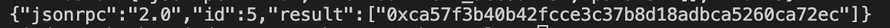


**→ Send ETH to accounts**

**Syntax:**
```shell
    curl -X POST http://http://127.0.0.1:8545 \
        -H "Content-Type: application/json" \
       --data '{"jsonrpc":"2.0", "method":"eth_sendTransaction", "params":[{"from": "<ADDRESS_1>","to": "<ADDRESS_2>","value": "0x9184e72a"}], "id":1}'
```

You need to convert eth to wei and get the hex value to send a transaction.
For example:  0.0241 ether is 24100000000000000 wei, and would be encoded as the hex string "0x559ed283164000" in the JSON-RPC API.

**step 3:** Run the command below

```shell
curl -X POST http://127.0.0.1:8545 \
    -H "Content-Type: application/json" \
   --data '{"jsonrpc":"2.0", "method":"eth_sendTransaction", "params":[{"from": "0xca57f3b40b42fcce3c37b8d18adbca5260ca72ec","to": "0x1f7a76611939fbAcf7d2dAD2F864F6184BDCD690","value": "0x2386F26FC10000"}], "id":5}'
```

A successful call will return a response below:

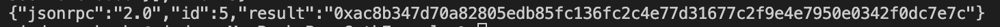

