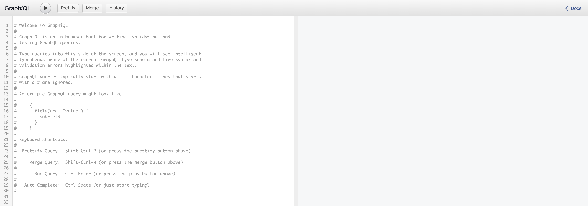

In addition to the [JSON-RPC APIs](../rpc/server), Geth supports the GraphQL API as specified by [EIP-1767](eip-1767). 
GraphQL lets you specify which fields of an object you need as part of the query eliminating 
the extra load on the client for filling in fields that are not needed. It also allows for 
combining several traditional JSON-RPC requests into one query, resulting in less overhead 
and more performance.


This flag `--graphql` enables GraphQL and GraphQL UI on the HTTP-RPC server. The geth graphql
listens to `http://127.0.0.1:8545/graphql` as default IP and port and 
you can access the graphql UI via `http://127.0.0.1:8545/graphql/ui`, see the image below.

```bash
geth --http --graphql
```

Now you can start querying against `http://localhost:8545/graphql`. 




> Starting an HTTP server is required to enable GraphQL and GraphQL UI.


If you want to enable access to the API from a web page,
you must configure geth graphql server to accept Cross-Origin 
requests with the `--graphql.corsdomain flag`. Also, you can add 
more than one domain to accept cross-origin requests by separating them with a comma (,).

```bash
geth --http --graphql --http.corsdomain "*"
```

To enable access to the virtual hostnames from a server,
you will configure geth graphql server to accept requests 
from that hostname with the `--graphql.vhosts` flag. Also, 
you can add more than one hostname using the flag.

```bash
geth --http --graphql.vhosts http://localhost:9002/
```

### GraphiQL

An easy way to get started and try out queries is the GraphiQL interface shipped with Geth.
To open it, visit `http://localhost:8545/graphql/ui`. To see how this works, read the sender, 
recipient, and value of all transactions in block number 6000000. Then, try this out in GraphiQL:

```graphql
query txInfo {
    block (number: 6000000) { transactions { hash from { address } to { address } value } }
}
```

GraphiQL also provides a way to explore Geth's schema to help you formulate your queries,
which you can see on the right sidebar. For example, click on `Query` under the title `Root
Types` to see the high-level types and their fields.

### Query

Reading out data from Geth is the most significant use-case for GraphQL.
However, after trying out queries in the graphql UI, you may want to do 
it programmatically. For example, you can consult the official [docs](graphql-code) to 
find bindings for your language. Or use your favorite tool for sending 
HTTP requests. For completeness, we briefly touch on two approaches here: **cURL** and a **JS script**.


Here's how you'd get the latest block's number via cURL. Note the use of a JSON object for the data section:

```bash
❯ curl -X POST http://localhost:8545/graphql -H "Content-Type: application/json" --data '{ "query": "query { block { number } }" }'
{"data":{"block":{"number":6004069}}}
```

Alternatively store the JSON-ified query in a file (let's call it `block-num.query`) and do:

```bash
❯ curl -X POST http://localhost:8545/graphql -H "Content-Type: application/json" --data '@block-num.query'
```

Executing a simple query in JS looks like the following. Here we're using the lightweight library `graphql-request` to perform the request. Note the use of variables instead of hardcoding the block number in the query:

```javascript
const { request, gql } = require('graphql-request')

const query = gql`
    query blockInfo($number: Long) {
        block (number: $number) { hash stateRoot }
    }
`
request('http://localhost:8545/graphql', query, { number: '6004067' })
    .then((res) => { console.log(res) })
    .catch((err) => { console.log(err) })
```

[eip-1767]: https://eips.ethereum.org/EIPS/eip-1767
[graphql-code]: https://graphql.org/code/
