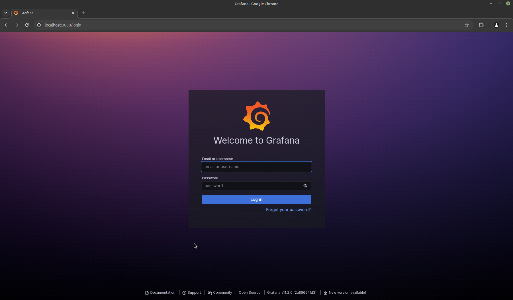
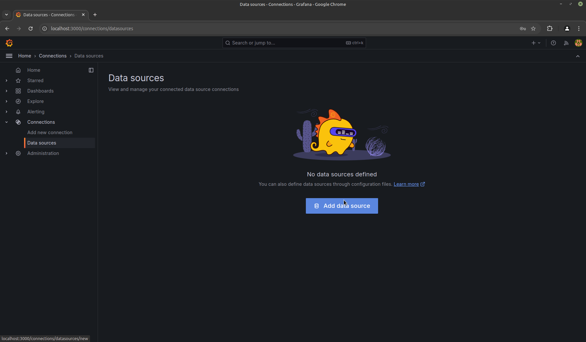
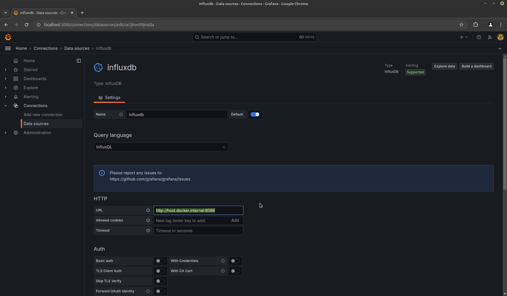
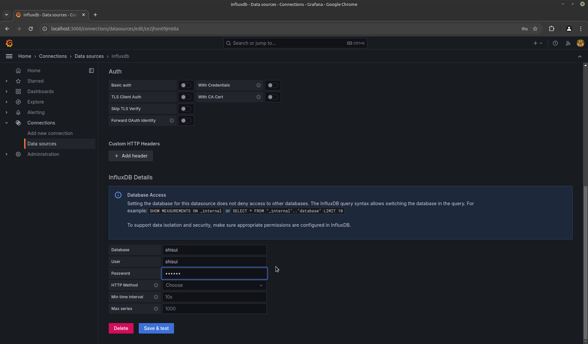
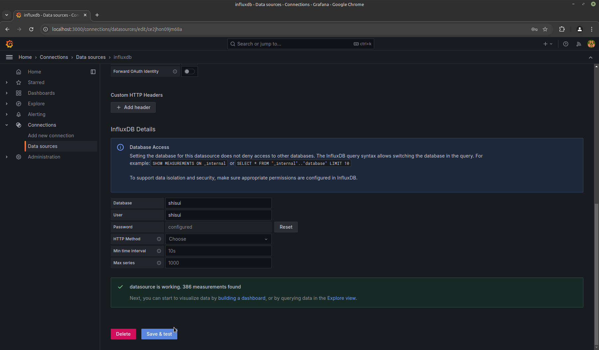
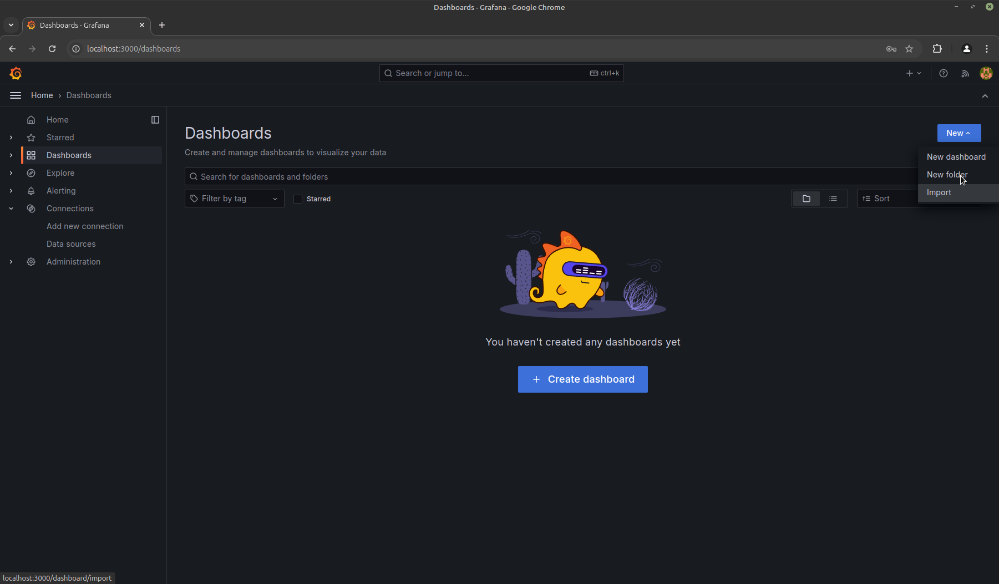
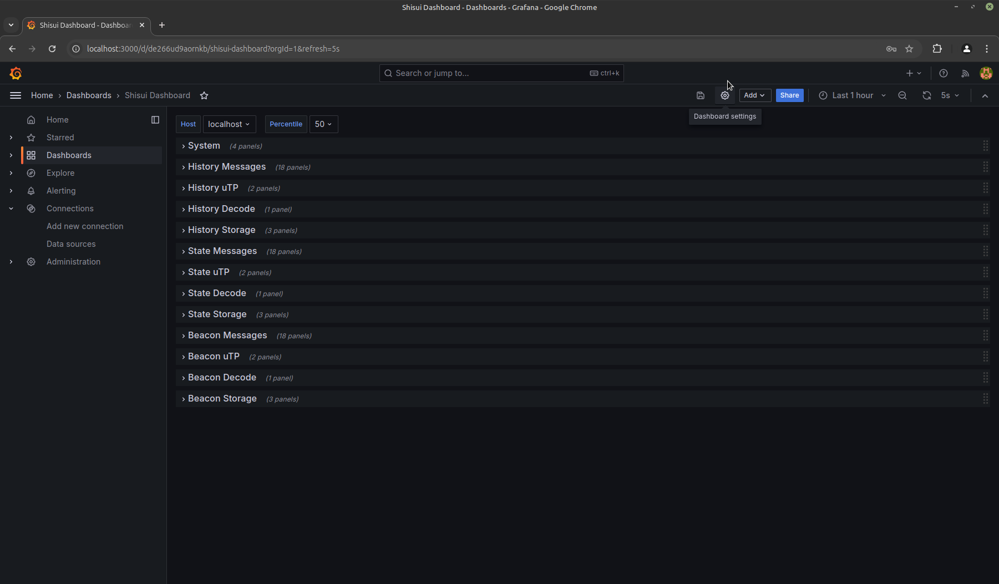
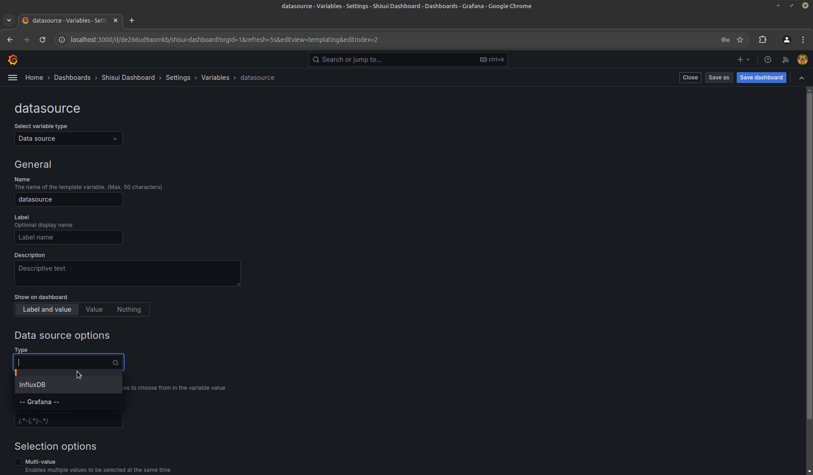
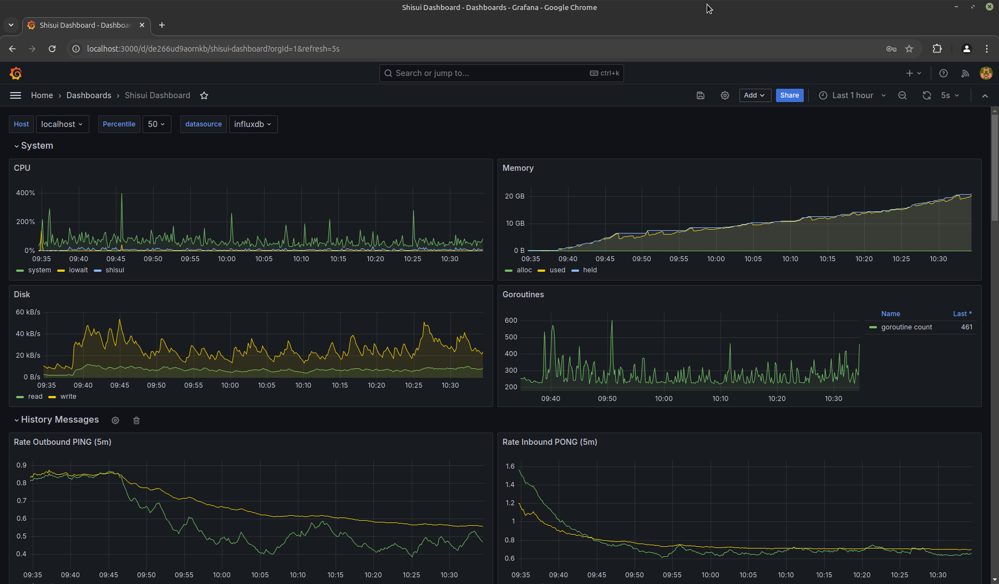

# Monitoring Shisui with InfluxDB and Grafana

This tutorial will guide you through the process of installing [Shisui](https://github.com/optimism-java/shisui), which is a [Portal Network](https://ethportal.net/) client, and the auxiliary software [InfluxDb](https://www.influxdata.com/products/influxdb/) and [Grafana](https://grafana.com/). With this set up, it will be possible to run a dashboard to monitor the behavior of a network node running Shisui.

All the steps described here are based on [Docker](https://www.docker.com/), except for Shisui, but you can also install the software directly on the operating system. Links to documentation describing different types of installation will be provided.

## Setting up InfluxDB

To run InfluxDB using Docker run the command below:

```sh
docker run \
 --name influxdb \
 --publish 8086:8086 \
 --add-host host.docker.internal:host-gateway \
 influxdb:1.11
```

If you're using a system that doesn't have Docker, or if you prefer to install InfluxDB directly on the operating system, check out the installation options available in [the documentation](https://docs.influxdata.com/influxdb/v2/install/).

From another terminal, you can execute [InfluxDB CLI](https://docs.influxdata.com/influxdb/v2/tools/influx-cli/) to finalize the InfluxDB configuration. Create the user:

```sh
curl -XPOST "http://localhost:8086/query" --data-urlencode "q=CREATE USER admin WITH PASSWORD 'admin' WITH ALL PRIVILEGES"
```
Note that when creating the user we chose the name “admin” and the password “admin”, you can change these values if you want a different administrator user.

Then log in to the InfluxDB CLI:

```sh
influx -username 'admin' -password 'admin'
```

Create a database and a user for Shisui metrics.

```sh
create database shisui
create user shisui with password 'shisui'
```

Verify created database and user:

```sh
show databases
show users
```

Leave InfluxDB CLI.

```sh
quit
```

InfluxDB is running and configured to store metrics from Shisui.

## Preparing Shisui

The next step is to install and run Shisui with the parameters that allow the metrics to be exported to our InfluxDB instance. Shisui is software written in the [Go](https://go.dev/) language, so if you don't have a compiler installed, you'll need one. Follow the instructions on the official website to [install](https://go.dev/doc/install) the compiler on your machine.

Download the latest version of Shisui:
```sh
git clone https://github.com/optimism-java/shisui.git
```

Enter the `shisui` directory and install:
```sh
cd shisui
make shisui
```

After running the above commands, you should already be able to run Shisui with the command `./build/bin/shisui`, but we can move it to the system path (you'll need sudo permission):
```sh
sudo mv ./build/bin/shisui /usr/local/bin
```

Then run Shisui with the command:
```sh
shisui --data.dir $HOME/.shisui --nat stun --networks "history,beacon,state" --metrics --metrics.influxdb --metrics.influxdb.endpoint "http://127.0.0.1:8086" --metrics.influxdb.username "shisui" --metrics.influxdb.password "shisui" --metrics.influxdb.database shisui
```

The parameters used are:
- data.dir - configures the directory in which the databases with network data and metadata will be stored.
- nat - configures the stun server, used to pick up the external IP. If you're not behind a NAT you don't need this parameter, but if you don't know anything about it, use it.
- networks - configures the Shisui node to run on the three subnets: history, beacon, and state.
- metrics - enable metrics collection.
- metrics.influxdb - enable the InfluxDB V1 database to be fed with the collected metrics.
- metrics.influxdb.endpoint - InfluxDB address for sending metrics.
- metrics.influxdb.username - username used by Shisui to feed data into InfluxDB.
- metrics.influxdb.password - user password used by Shisui to feed data into InfluxDB. 
- metrics.influxdb.database - InfluxDB database used.

You can verify that Shisui is successfully pushing data by listing metrics in the database using InfluxDB CLI:
```sh
influx -username 'admin' -password 'admin'
use shisui
show measurements
```

Shisui also provides other configuration parameters and even the option to run with Docker, more information can be found in its [documentation](https://github.com/optimism-java/shisui?tab=readme-ov-file#shisui).

## Setting up Grafana

Execute Grafana using Docker with the command:

```sh
docker run \
 --publish 3000:3000 \
 --add-host host.docker.internal:host-gateway \
 grafana/grafana:latest
```

After the above command, Grafana should already be accessible, open any browser and access the address [`localhost:3000`](http://localhost:3000). When prompted for a username and password, use the default `admin` and `admin` respectively.



You will be redirected to the Grafana home page. First, set up your datasource. Click on the configuration icon in the left bar and select "Data sources".



There aren't any datasources created yet, click on “Add datasource” to define one. For this setup, select “InfluxDB” and proceed. Two sets of values need to be configured when creating an InfluxDB datasource. The first is the “HTTP” fields, configure the “URL” with the value `http://host.docker.internal:8086` as shown below:



Then configure our created dabasse “shisui” with the username and password of our created user shisui:



Click on the “Save and Test” button to check that the configuration was successful:



Now let's create a dashboard that consumes the data from the datasource. Click on the configuration icon in the right bar and select “Dashboards”, then, on the top right-hand side of the screen, click on the “New” menu and choose the “import” option:



Click on “Upload dashboard JSON file” and choose the file [provided](shisuiDashboard.json) and import it.

The dashboard should not be working, this is due to a connection failure with the datasource, so let's configure it. In the top right corner, click on the “Dashboard settings” icon:



In Settings, go to the tab “Variables” and click on “New variable”. When setting up our new variable, we need to change 3 places. The type needs to be “Data source” and the name “datasource”. In the “type” menu of the “Data source options” section, we choose our newly created influxDB datasource:



Click on “Apply” and save the changes made to the Dashboard. By now you have your dashboard up and running:


